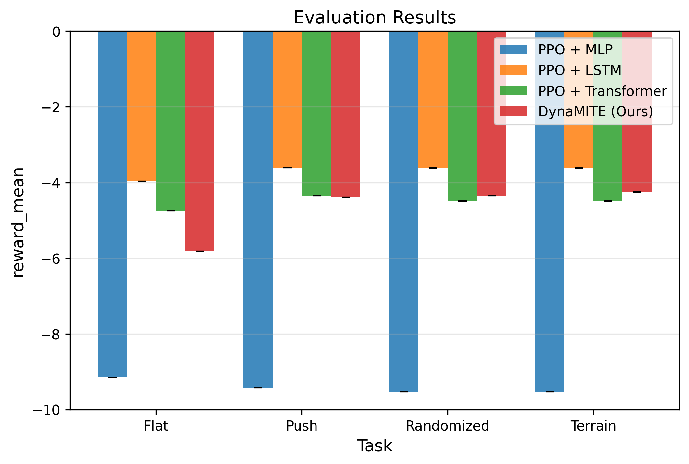
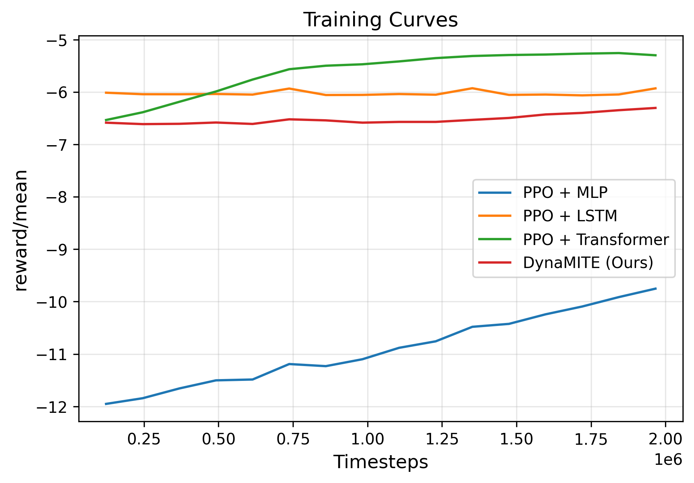
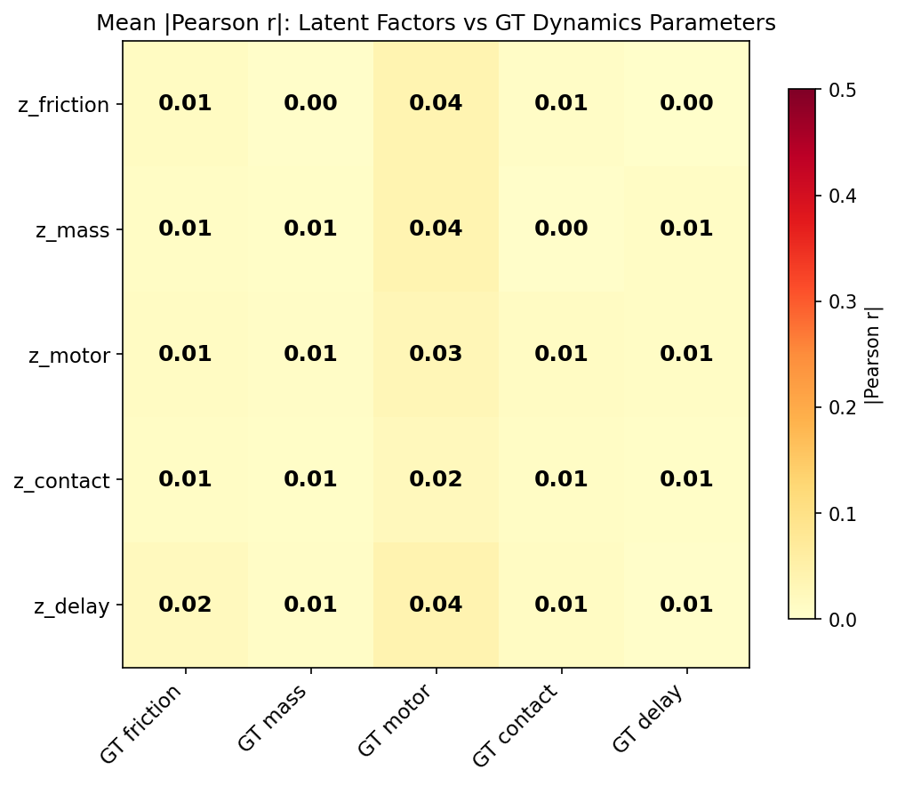
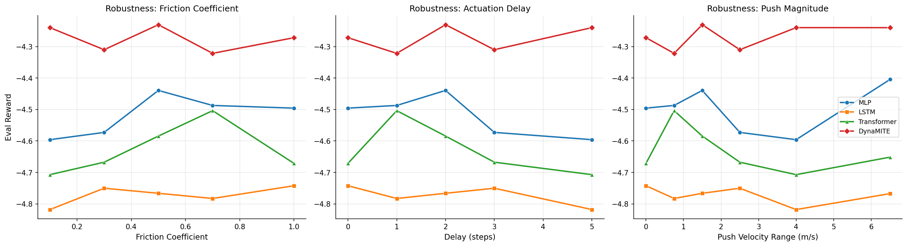

# DynaMITE: Dynamic Mismatch Inference via Transformer Encoder for Humanoid Locomotion

We study whether a short-horizon transformer encoder can infer a factorized latent representation of hidden dynamics parameters — friction, mass, motor strength, contact properties, and actuation delay — from proprioceptive history alone.
DynaMITE conditions both the policy and value function on this latent vector and trains per-factor auxiliary identification losses during PPO optimization.
We evaluate on a Unitree G1 humanoid in Isaac Lab across four locomotion tasks with domain randomization.

Across 5 seeds with deterministic 100-episode evaluation, **LSTM achieves the best aggregate reward on all four tasks** (p < 0.03 on all, paired t-test), with DynaMITE ranking second on push, randomized, and terrain.
DynaMITE shows **lower sensitivity than LSTM** across three tested OOD perturbation types (friction, push magnitude, action delay; n = 3 seeds), and its factored latent achieves a **0.500 ± 0.020 score on a custom within-factor correlation metric** across 3 seeds (chance = 0.20).
DynaMITE did not outperform LSTM on nominal reward. Its potential value is a **tradeoff: worse in-distribution performance for lower OOD sensitivity and partial latent factor alignment**.

---

## Contributions

1. **Factorized latent dynamics inference.** A transformer encoder maps an 8-step (160 ms) observation–action history to a 24-d latent vector decomposed into 5 subspaces intended to align with ground-truth dynamics parameters (friction, mass, motor, contact, delay).

2. **Per-factor auxiliary supervision.** Each subspace is trained against the corresponding ground-truth dynamics parameter via MSE loss during training. At deployment, no privileged information is required.

3. **Controlled comparison** of MLP, LSTM, Transformer, and DynaMITE policies under identical PPO training on the same four tasks, with shared observation/action embeddings, policy heads, and value heads. LSTM outperformed all other methods on aggregate reward.

4. **Latent factor alignment analysis.** Under a custom within-factor correlation metric (see [Evaluation Protocol](#evaluation-protocol)), the learned subspaces achieve a mean score of 0.500 ± 0.020 across 3 seeds (chance = 0.20 for 5 factors). This indicates partial alignment but is not measured using standard disentanglement benchmarks.

5. **Single-GPU reproducible pipeline.** `reproduce_all.sh` trains 69 runs (3 seeds) + evaluates + runs OOD sweeps + latent analysis + generates tables/figures in ~12 hours on an RTX 4060 Laptop GPU. The full 5-seed experiment set reported below took ~24 hours.

---

## Method

```
     History Buffer (8 steps)
    ┌─────────────────────────┐
    │ [obs₁,act₁]…[obs₈,act₈]│
    └───────────┬─────────────┘
                │
    ┌───────────▼─────────────┐
    │ Token Embedding + PE    │
    └───────────┬─────────────┘
                │
    ┌───────────▼─────────────┐
    │ Transformer Encoder     │
    │ (2 layers, 4 heads,     │
    │  d_model=128)           │
    └───────────┬─────────────┘
                │ mean pool
       ┌────────┼────────┐
       │        │        │
  ┌────▼───┐ ┌──▼──┐ ┌──▼──┐
  │Factored│ │π(a|s│ │V(s) │
  │Latent  │ │,z)  │ │     │
  │Head    │ └──▲──┘ └──▲──┘
  │ z∈R²⁴  │    │concat  │
  │────────┼────┘        │
  │        ├─────────────┘
  │ aux ID │
  │ losses │ (train only)
  └────────┘
```

**Loss:**
$$\mathcal{L} = \mathcal{L}_{\text{PPO}} + c_v \mathcal{L}_{\text{value}} + 0.1 \sum_{f} \mathcal{L}_{\text{aux},f}$$

All four model architectures share the same observation embedding, action embedding, policy MLP, and value MLP (`src/models/components.py`).

| Model | History | Latent | Aux Loss | Params\* |
|---|---|---|---|---|
| MLP | None | No | No | 266–362k |
| LSTM | Hidden state | No | No | 176–215k |
| Transformer | 8 steps | No | No | 330–342k |
| DynaMITE | 8 steps | 24-d factored | Yes | 342–392k |

\*Parameter counts vary by task due to different observation dimensions (flat: smaller obs → lower end; terrain: obs + height-map features → higher end). See `docs/architecture.md` for tensor shape details.

---

## Evaluation Protocol

All results below follow this protocol, locked before running the main experiment campaign.

### Training Protocol

| Setting | Value |
|---|---|
| Algorithm | PPO (clipped objective, GAE) |
| Parallel envs | 512 (Isaac Lab vectorized) |
| Total timesteps | 10 M per run |
| Timestep (dt) | 20 ms (50 Hz control) |
| Checkpoint interval | Every 614,400 steps (~every 60 s) |
| Checkpoint selection | **Best** checkpoint by training-time stochastic eval reward |
| Training seeds | Unique per run; controls env randomization, network init, and PPO sampling |

### Evaluation Protocol

| Setting | Value |
|---|---|
| Eval mode | **Deterministic** — action = distribution mean, no sampling |
| Episodes per eval | 100 (main comparison, ablations); 50 (OOD sweeps) |
| Env reset | Full reset between episodes (randomized initial joint positions + domain parameters) |
| Eval env seed | Fixed at 42 for all models within a task (independent of training seed) |
| Episode termination | Fixed-length rollout (no early termination) |
| Reward aggregation | Mean of per-episode cumulative reward across all eval episodes |
| Main comparison | 5 training seeds (42, 43, 44, 45, 46) × 4 tasks × 4 models = 80 evals |
| Multi-seed ablations | 5 training seeds (42, 43, 44, 45, 46) × 3 variants = 15 evals |
| OOD sweeps | 3 training seeds (42, 43, 44) × 2 models × 3 sweep types = 18 evals |
| Latent analysis | 3 training seeds (42, 43, 44) × 50 episodes each |

> **Deterministic vs stochastic eval.** During training, PPO uses stochastic policy evaluation (sampled actions, 20 episodes) for checkpoint selection. All numbers reported in this README use **deterministic evaluation** (mean action, 100 or 50 episodes) run after training completes. An initial pilot used stochastic 20-episode evaluation, which produced a different model ranking (MLP appeared best). The deterministic protocol is standard in Isaac Lab and eliminates action-sampling variance.

> **Same protocol for all models.** All four architectures (MLP, LSTM, Transformer, DynaMITE) share the same env wrapper, observation/action spaces, reward function, eval seed, episode count, and deterministic eval mode. The only difference is the policy network and whether auxiliary losses are active during training.

### Metrics

**Reward.** Penalty-based (always negative). Higher (less negative) = better. A method achieving −4.18 vs −4.48 accumulates ~6% less penalty per step on average.

**Factor alignment metric (custom).** We compute Pearson correlation between each learned latent subspace and each ground-truth dynamics parameter over 50 episodes. The "factor alignment score" is the ratio of mean within-factor correlation to mean total correlation across all factor–subspace pairs. This is a **custom metric** — not MIG, DCI, or SAP — and should not be directly compared to standard disentanglement benchmarks. It measures correlation, not causal alignment or independence. Chance level for 5 factors is 0.20. See `src/analysis/latent_analysis.py` for implementation.

**OOD sensitivity metric.** Sensitivity = max(mean reward) − min(mean reward) across sweep levels. This is a simple range metric; it does not capture curve shape or monotonicity. Lower = more robust.

### Statistical Reporting

For the **main comparison** (n = 5 seeds), we report:
- Mean ± sample standard deviation
- 95% confidence intervals (CI) via the t-distribution: $\text{CI} = \bar{x} \pm t_{0.025,\,n-1} \cdot s / \sqrt{n}$
- Paired t-tests (two-sided) for LSTM vs DynaMITE on matched seeds

For **ablations** (n = 5 seeds), we additionally report paired t-tests (Full vs variant). For **OOD sweeps** (n = 3 seeds), statistical power is limited. We report mean ± std but note that paired t-tests with n = 3 have very low power and p-values should be interpreted cautiously.

We do **not** report bootstrap CIs, permutation tests, or effect sizes in this version. These are noted as future work.

---

## Results

### Main Comparison (5 seeds, deterministic eval)

<p align="center">
  
</p>

| Method | Flat | Push | Randomized | Terrain |
|---|---|---|---|---|
| MLP | -4.83 ± 0.14 | -5.01 ± 0.32 | -5.32 ± 0.50 | -4.82 ± 0.29 |
| LSTM | **-4.01 ± 0.04** | **-4.30 ± 0.04** | **-4.18 ± 0.05** | **-4.06 ± 0.04** |
| Transformer | -5.02 ± 0.36 | -4.83 ± 0.69 | -4.77 ± 0.41 | -4.46 ± 0.12 |
| DynaMITE | -4.88 ± 0.26 | -4.60 ± 0.13 | -4.48 ± 0.16 | -4.49 ± 0.15 |

Values are mean ± std across 5 seeds. Per-seed eval rewards and 95% CIs are in the collapsed section below.

<details>
<summary><strong>95% Confidence Intervals and Paired Tests</strong></summary>

#### 95% CIs (t-distribution, n = 5)

| Method | Flat | Push | Randomized | Terrain |
|---|---|---|---|---|
| MLP | [-5.00, -4.66] | [-5.41, -4.61] | [-5.94, -4.70] | [-5.18, -4.46] |
| LSTM | [-4.07, -3.96] | [-4.35, -4.25] | [-4.24, -4.12] | [-4.11, -4.01] |
| Transformer | [-5.46, -4.57] | [-5.69, -3.97] | [-5.29, -4.26] | [-4.61, -4.31] |
| DynaMITE | [-5.21, -4.56] | [-4.77, -4.44] | [-4.67, -4.29] | [-4.68, -4.31] |

#### Paired t-tests: LSTM vs DynaMITE (matched training seeds)

| Task | Mean Diff (LSTM − DynaMITE) | Paired t | p-value |
|---|---|---|---|
| Flat | +0.870 ± 0.229 | 8.49 | 0.0011 |
| Push | +0.305 ± 0.145 | 4.69 | 0.0094 |
| Randomized | +0.303 ± 0.203 | 3.34 | 0.029 |
| Terrain | +0.435 ± 0.114 | 8.55 | 0.0010 |

LSTM is significantly better than DynaMITE on all four tasks (p < 0.05, paired t-test, n = 5). The largest gap is on flat (+0.87); the smallest on push and randomized (~+0.30). These are two-sided tests without multiple-comparison correction.

</details>

LSTM achieves the best mean reward on all four tasks with the lowest variance (σ ≤ 0.05). All four paired t-tests (LSTM vs DynaMITE) are significant at p < 0.03.
DynaMITE ranks second on push, randomized, and terrain with moderate variance.
MLP shows high variance on randomized (σ = 0.50) and is the weakest model overall.

### Training Curves

<p align="center">
  
</p>

### Ablation Study (Randomized Task, 10M Steps)

#### Multi-seed ablations (5 seeds: 42–46, deterministic eval)

We train the three most impactful ablation variants with 5 seeds each (matching the main comparison) and evaluate with deterministic 100-episode evaluation.

| Variant | Deterministic Eval Reward | Δ vs Full | 95% CI |
|---|---|---|---|
| DynaMITE (Full) | **-4.48 ± 0.16** | — | [-4.68, -4.29] |
| No Aux Loss | -4.56 ± 0.27 | -0.08 | [-4.89, -4.23] |
| No Latent | -4.77 ± 0.41 | -0.29 | [-5.29, -4.26] |
| Single Latent (unfactored) | -4.67 ± 0.11 | -0.19 | [-4.80, -4.54] |

<details>
<summary><strong>Paired t-tests and per-seed data (n = 5)</strong></summary>

#### Paired t-tests: Full vs ablation variants

| Variant | Delta | Paired t | p-value |
|---|---|---|---|
| No Aux Loss | -0.08 | 0.52 | 0.629 |
| No Latent | -0.29 | 1.65 | 0.174 |
| Single Latent | -0.19 | 2.55 | 0.063 |

No ablation variant reaches p < 0.05 with n = 5, though Single Latent approaches significance (p = 0.063). All three variants show consistent degradation in mean reward.

#### Per-seed rewards

| Seed | Full | No Aux Loss | No Latent | Single Latent |
|---|---|---|---|---|
| 42 | -4.39 | -5.01 | -4.39 | -4.70 |
| 43 | -4.46 | -4.32 | -4.47 | -4.79 |
| 44 | -4.34 | -4.43 | -5.28 | -4.64 |
| 45 | -4.74 | -4.52 | -5.16 | -4.72 |
| 46 | -4.47 | -4.51 | -4.57 | -4.51 |

</details>

**Observations:**
- All three ablation variants show consistent directional degradation compared to the full model (Δ = 0.08–0.29), but no variant reaches statistical significance at p < 0.05 with n = 5.
- **No Latent** shows the largest mean degradation (Δ = -0.29, p = 0.174) and highest variance (σ = 0.41). The direction is consistent (4/5 seeds degrade) but the effect is not statistically reliable at this sample size.
- **Single Latent (unfactored)** shows Δ = -0.19, p = 0.063. This does not reach significance. All 5 seeds show degradation, suggesting a consistent but small effect that would require more seeds to confirm.
- **No Aux Loss** shows the smallest mean degradation (Δ = -0.08, p = 0.629) with high variance (σ = 0.27) and inconsistent direction (2/5 seeds improve). The auxiliary loss may not contribute meaningfully to nominal reward.
- These results use the same deterministic 100-episode protocol as the main comparison.

### Latent Factor Alignment Analysis

We measure whether DynaMITE's learned latent subspaces correlate with their intended ground-truth dynamics parameters using Pearson correlation (50 episodes per seed, 3 seeds).

<p align="center">
  
</p>

| Seed | Within-Factor Correlation Score |
|---|---|
| 42 | 0.496 |
| 43 | 0.482 |
| 44 | 0.521 |
| **Mean** | **0.500 ± 0.020** |

- **Mean score: 0.500 ± 0.020** under our custom within-factor correlation metric (chance = 0.20 for 5 factors). This is not a standard disentanglement measure (see [Evaluation Protocol](#evaluation-protocol)).
- The score exceeds chance, indicating partial factor alignment. However, the metric measures correlation only — not independence, causal alignment, or invariance. Cross-talk between subspaces remains, and whether 0.50 constitutes meaningful alignment depends on the application.
- No intervention experiments (clamping or perturbing individual latent dimensions) have been performed, so the correlation evidence does not establish causal factor alignment.
- Full analysis in `figures/latent_correlation_full.png`.

### OOD Sensitivity Sweeps (3 seeds: 42, 43, 44)

We evaluate DynaMITE and LSTM under three OOD perturbation types on the randomized task (50 episodes per level per seed). **Only DynaMITE and LSTM are compared** (the top-2 models by aggregate reward); MLP and Transformer were not included in multi-seed OOD sweeps. With n = 3 seeds, statistical power is low and these results should be treated as directional evidence, not definitive conclusions.

<p align="center">
  
</p>

#### Friction Sweep

| Method | Fric 1.0 | Fric 0.7 | Fric 0.5 | Fric 0.3 | Fric 0.1 | Sensitivity |
|---|---|---|---|---|---|---|
| DynaMITE | -4.40 ± 0.07 | -4.40 ± 0.08 | **-4.38 ± 0.08** | **-4.38 ± 0.07** | **-4.38 ± 0.07** | **0.03** |
| LSTM | **-4.17 ± 0.06** | **-4.20 ± 0.07** | -4.14 ± 0.07 | -4.24 ± 0.03 | -4.34 ± 0.07 | 0.20 |

#### Push Magnitude Sweep

| Method | Push 0 | Push 0.5–1 | Push 1–2 | Push 2–3 | Push 3–5 | Push 5–8 | Sensitivity |
|---|---|---|---|---|---|---|---|
| DynaMITE | -4.31 ± 0.09 | -4.36 ± 0.08 | -4.41 ± 0.08 | **-4.44 ± 0.06** | **-4.49 ± 0.05** | **-4.56 ± 0.05** | **0.25** |
| LSTM | **-3.64 ± 0.15** | **-4.06 ± 0.03** | **-4.20 ± 0.09** | -4.43 ± 0.02 | -4.67 ± 0.02 | -5.03 ± 0.08 | 1.39 |

#### Action Delay Sweep

| Method | Delay 0 | Delay 1 | Delay 2 | Delay 3 | Delay 5 | Sensitivity |
|---|---|---|---|---|---|---|
| DynaMITE | -4.40 ± 0.07 | -4.41 ± 0.07 | -4.39 ± 0.07 | **-4.39 ± 0.06** | -4.40 ± 0.07 | **0.02** |
| LSTM | **-4.20 ± 0.06** | **-4.20 ± 0.06** | **-4.18 ± 0.09** | -4.15 ± 0.09 | **-4.21 ± 0.07** | 0.05 |

**Observations:**
- Under the tested sweeps, DynaMITE shows lower sensitivity than LSTM under friction (0.03 vs 0.20) and push magnitude (0.25 vs 1.39). Under action delay both are relatively stable (0.02 vs 0.05).
- LSTM achieves better absolute rewards at most levels due to its overall reward advantage, but degrades more steeply under strong pushes (-5.03 at push 5–8 vs DynaMITE's -4.56).
- DynaMITE's reward is nearly flat across friction levels and delay values, which is consistent with its latent inference helping to compensate for parameter shifts, though other explanations (e.g., generally flatter reward landscape) cannot be ruled out.
- The push magnitude sweep shows the largest gap: LSTM's sensitivity (1.39) is 5.6× that of DynaMITE (0.25).
- These sweeps cover only 3 perturbation axes and 2 models. Generalization to other perturbation types or model pairs is not established.

---

## When to Use DynaMITE vs LSTM

| Scenario | Recommended |
|---|---|
| Maximize nominal in-distribution reward | **LSTM** — wins all 4 tasks significantly |
| Expected dynamics mismatch at deployment (e.g., sim-to-real) | **DynaMITE** — lower sensitivity under tested perturbations (n = 3, directional evidence only) |
| Need to inspect latent dynamics estimates | **DynaMITE** — factored latent shows partial factor alignment (correlational, not causal) |
| Training budget is tight | **LSTM** — fewer parameters, no auxiliary loss overhead |
| Deployment environment is well-characterized | **LSTM** — DynaMITE's sensitivity advantage is unnecessary |

---

## Limitations

- **LSTM dominates aggregate reward.** LSTM achieves the best mean reward on all four tasks with the lowest seed variance (p < 0.03 on all four, paired t-test). DynaMITE's potential value is a tradeoff — lower OOD sensitivity at the cost of worse nominal performance — not overall superiority.
- **Narrow reward spread.** The top-2 models (LSTM, DynaMITE) fall within [-4.01, -4.60] across tasks — a range of ~0.6. Whether this is practically meaningful for a physical robot is unknown.
- **No sim-to-real transfer.** All experiments are in simulation (Isaac Lab). Not validated on physical hardware.
- **OOD sweep scope.** Multi-seed OOD sweeps cover DynaMITE and LSTM only (n = 3 seeds). MLP and Transformer were excluded. Statistical power at n = 3 is low; sensitivity differences are directional evidence, not definitive.
- **Custom factor alignment metric.** The 0.500 ± 0.020 score uses a within-factor correlation ratio, not a standard disentanglement metric (MIG, DCI, SAP). It measures correlation, not causal alignment. Direct comparison to other work is not possible.
- **No causal latent evidence.** No intervention experiments (clamping or perturbing latent dimensions) have been performed. The factor alignment is correlational only.
- **Reward is penalty-based.** A method achieving -4.18 vs -4.48 accumulates ~6% less penalty per step on average. Practical significance is unclear without real-world deployment.
- **Ablation significance.** No ablation variant reaches statistical significance at p < 0.05 with n = 5, though all three show consistent directional degradation (Δ = 0.08–0.29).
- **Sensitivity metric is coarse.** The max−min range metric for OOD sweeps ignores curve shape and may be sensitive to endpoint selection.
- **No multiple-comparison correction.** Paired t-tests across four tasks are reported without Bonferroni or Holm correction.

---

## Future Work

- **Standard disentanglement metrics.** Supplement the custom within-factor correlation metric with established measures (MIG, DCI, SAP) for comparability with the representation learning literature.
- **Intervention experiments.** Clamp or perturb individual latent subspace dimensions and measure the effect on policy behavior — this would provide causal evidence of latent-factor alignment beyond correlation.
- **Cross-factor leakage analysis.** Quantify off-diagonal leakage in the correlation matrix and report it alongside the disentanglement score.
- **Latent response curves.** Plot per-subspace latent activations as a function of individual ground-truth parameters (friction, mass, delay) varied one-at-a-time, to visualize monotonicity and sensitivity.
- **Bootstrap / permutation CIs.** Replace or supplement t-distribution CIs with non-parametric bootstrap intervals.
- **Multiple-comparison correction.** Apply Bonferroni or Holm correction to the paired t-tests across tasks.
- **Broader OOD coverage.** Extend sweeps to MLP and Transformer, and add perturbation types (mass, contact stiffness, observation noise).

---

## Reproduction

### Requirements

| Requirement | Tested Version |
|---|---|
| OS | Ubuntu 20.04+ |
| GPU | NVIDIA RTX 4060 Laptop (8 GB VRAM) |
| CUDA | 12.1 |
| Python | 3.10 |
| PyTorch | 2.2 |
| Isaac Sim | 4.0+ |
| Isaac Lab | Compatible with Isaac Sim 4.0 |
| Disk space | ~15 GB (training outputs) |
| RAM | 14 GB+ |

### Setup

```bash
git clone https://github.com/fjkrch/g1-factorized-latent-locomotion.git
cd g1-factorized-latent-locomotion
conda env create -f environment.yml
conda activate env_isaaclab
python -m pytest tests/ -v
```

### Quick start

```bash
# Train DynaMITE on randomized task
python scripts/train.py --task randomized --model dynamite --seed 42

# Evaluate
python scripts/eval.py --run_dir outputs/randomized/dynamite_full/seed_42/*/

# Full 3-seed reproduction (69 training runs + eval + OOD + latent + tables/figures, ~12 hours)
bash scripts/reproduce_all.sh
# Or dry-run first:
bash scripts/reproduce_all.sh --dry-run
```

> **Note:** `reproduce_all.sh` uses 3 seeds (42–44). The 5-seed main comparison in the Results section above used additional campaign scripts (`run_all_main.sh` with seeds 42–46, ~19 hours). No pre-trained checkpoints are provided; all models must be trained from scratch.

### Runtime (RTX 4060 Laptop, 512 envs)

| Run set | Time |
|---|---|
| Single training run (10M steps) | ~14 min |
| `reproduce_all.sh` (3-seed, 69 training + eval + analysis) | ~12 hours |
| All 80 main runs (4 tasks × 4 models × 5 seeds) | ~19 hours |
| 80 deterministic evals (100 episodes each) | ~5 hours |
| 15 ablation runs (3 variants × 5 seeds) | ~3.5 hours |
| 18 OOD sweep evals | ~1 hour |
| Latent analysis (3 seeds) | ~15 min |
| **Full 5-seed experiment set** | **~24 hours** |

### Artifact Mapping

| README Section | Script | Output |
|---|---|---|
| Main Comparison table | `scripts/eval.py` → `scripts/aggregate_seeds.py` | `results/aggregated/` |
| Main Comparison figure | `scripts/plot_results.py` | `figures/eval_bars.png` |
| Training Curves figure | `scripts/plot_results.py` | `figures/training_curves.png` |
| Ablation table | `scripts/generate_tables.py` | `figures/ablation_table.md` |
| Factor alignment table | `scripts/run_latent_analysis.py` | `results/latent_analysis/` |
| Factor alignment heatmap | `scripts/run_latent_analysis.py` | `figures/latent_correlation_heatmap.png` |
| OOD Sweep tables | `scripts/eval_ood_validated.py` | `results/ood_sweeps/` |
| OOD Sweep figure | `scripts/plot_sweeps.py` | `figures/sweep_robustness_combined.png` |

---

## Repository Structure

```
├── configs/             # YAML configs (base, task, model, train, ablations)
├── src/
│   ├── models/          # MLP, LSTM, Transformer, DynaMITE policies
│   ├── envs/            # Isaac Lab G1 wrapper, reward function
│   ├── algos/           # PPO trainer
│   ├── utils/           # Config, seeding, checkpointing, logging
│   └── analysis/        # Plotting, tables, latent analysis
├── scripts/             # train.py, eval.py, batch run scripts
├── tests/               # Unit tests
├── docs/                # Architecture and config documentation
├── reproducibility/     # Checklist and expected results reference
└── outputs/             # Training outputs (git-ignored)
```

---

## Citation

```bibtex
@article{dynamite2026,
  title   = {{DynaMITE}: Dynamic Mismatch Inference via Transformer Encoder
             for Humanoid Locomotion},
  author  = {Chayanin Kraicharoen},
  year    = {2026},
  note    = {Preprint / under review}
}
```

## License

MIT. See [LICENSE](LICENSE).
