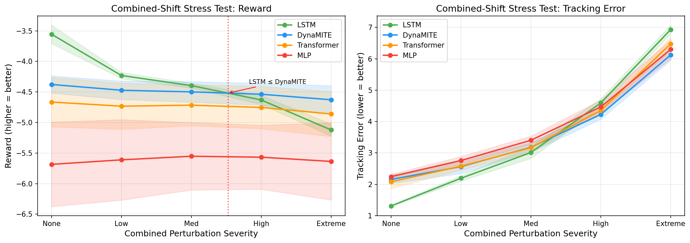
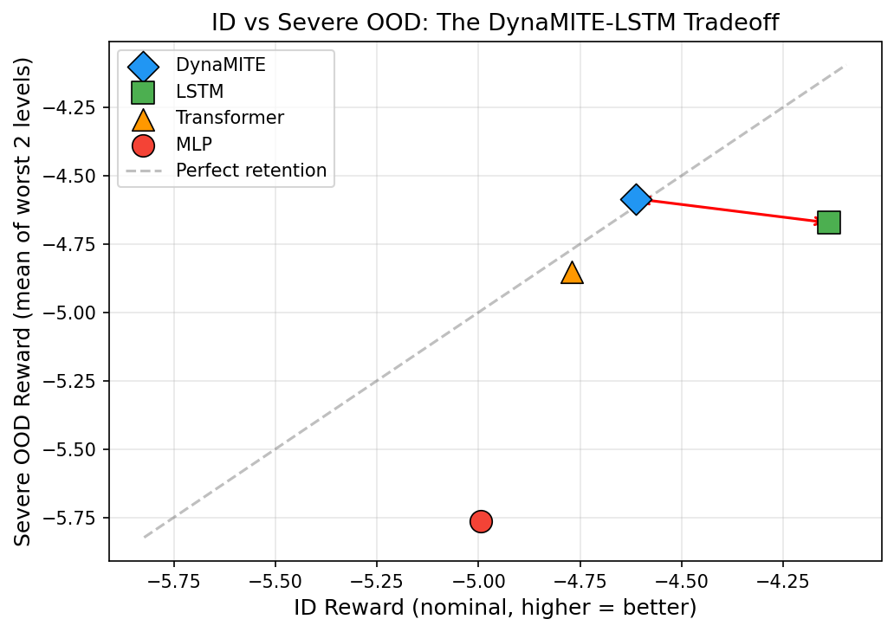

# DynaMITE: Per-Factor Auxiliary Dynamics Losses Regularize but Do Not Identify Dynamics in Humanoid Locomotion

We study whether per-factor auxiliary dynamics losses, applied to a short-horizon transformer encoder during PPO training, produce a factorized latent representation that captures hidden dynamics parameters in humanoid locomotion. On a Unitree G1 humanoid in Isaac Lab across four tasks with domain randomization, **the answer is no**: linear and nonlinear probes show the resulting 24-d latent has R² ≈ 0 for all five dynamics factors (friction, mass, motor strength, contact, delay), and per-factor clamping produces negligible reward change (|Δ| < 0.05). An LSTM baseline with no auxiliary signal achieves higher probe R² (up to 0.10) from its hidden state alone.

Despite this failure of the intended inference mechanism, the auxiliary-loss architecture exhibits a consistent empirical tradeoff. Across 5 seeds with deterministic 100-episode evaluation, **LSTM achieves the best reward on all four tasks** (p < 0.03, paired t-test). However, under a combined-shift stress test (friction + push + delay simultaneously), LSTM reward degrades by 16.7% from ID baseline to severe OOD, while DynaMITE degrades by only 2.3%. LSTM's reward advantage diminishes and directionally inverts at combined-shift level 3. In a controlled push-recovery protocol, DynaMITE recovers command tracking in ~6 steps independent of push magnitude (1–8 m/s), while LSTM recovery time increases from 9 to 20 steps.

We present this as an empirical tradeoff result with negative mechanistic findings: per-factor auxiliary losses appear to act as a regularizer that reduces OOD sensitivity, but do not produce a decodable or causally separable dynamics representation.

---

## Contributions

1. **Architecture and negative mechanistic result.** A transformer encoder maps an 8-step (160 ms) observation–action history to a 24-d latent decomposed into 5 factor subspaces, trained with per-factor auxiliary dynamics losses during PPO. Probe analysis and latent intervention show this architecture **fails to produce a decodable or causally separable dynamics representation** (R² ≈ 0, all |Δ reward| < 0.05). An LSTM hidden state with no auxiliary training encodes dynamics better (R² up to 0.10). We report this failure in full.

2. **Empirical ID–OOD tradeoff quantification.** Under identical training and evaluation (5 seeds, deterministic 100-episode eval), LSTM achieves the best reward on all 4 in-distribution tasks (p < 0.03). Under combined OOD perturbation, LSTM degrades 7× more than DynaMITE (sensitivity 1.57 vs 0.25) and its advantage diminishes at level 3–4. We report exact crossover boundaries across 200+ evaluations.

3. **Controlled OOD evaluation suite.** Combined-shift stress test (friction + push + delay simultaneously, 5 severity levels), push-recovery behavioral protocol (7 magnitudes, recovery-time measurement), and cross-task OOD sweeps across 3 tasks. 200+ evaluations total. All evaluation code, configs, and raw results are released.

4. **Comprehensive representation analysis (predominantly negative).** Latent probe (Ridge + MLP, 5-fold CV, ~36k samples per run), factor-subspace intervention (90 evaluations), and correlational alignment analysis. All three produce null or weak results for DynaMITE's latent. The custom correlation metric (0.50 vs 0.20 chance) detects structure, but probes and interventions show this structure is not functionally meaningful. These negative results constrain the space of viable explanations for the observed robustness benefit.

---

## Method

```
     History Buffer (8 steps)
    ┌─────────────────────────┐
    │ [obs₁,act₁]…[obs₈,act₈]│
    └───────────┬─────────────┘
                │
    ┌───────────▼─────────────┐
    │ Token Embedding + PE    │
    └───────────┬─────────────┘
                │
    ┌───────────▼─────────────┐
    │ Transformer Encoder     │
    │ (2 layers, 4 heads,     │
    │  d_model=128)           │
    └───────────┬─────────────┘
                │ mean pool
       ┌────────┼────────┐
       │        │        │
  ┌────▼───┐ ┌──▼──┐ ┌──▼──┐
  │Factored│ │π(a|s│ │V(s) │
  │Latent  │ │,z)  │ │     │
  │Head    │ └──▲──┘ └──▲──┘
  │ z∈R²⁴  │    │concat  │
  │────────┼────┘        │
  │        ├─────────────┘
  │ aux    │
  │ losses │ (train only)
  └────────┘
```

**Loss:**
$$\mathcal{L} = \mathcal{L}_{\text{PPO}} + c_v \mathcal{L}_{\text{value}} + 0.1 \sum_{f} \mathcal{L}_{\text{aux},f}$$

All four model architectures share the same observation embedding, action embedding, policy MLP, and value MLP (`src/models/components.py`).

| Model | History | Latent | Aux Loss | Params\* |
|---|---|---|---|---|
| MLP | None | No | No | 266–362k |
| LSTM | Hidden state | No | No | 176–215k |
| Transformer | 8 steps | No | No | 330–342k |
| DynaMITE | 8 steps | 24-d factored | Yes | 342–392k |

\*Parameter counts vary by task due to different observation dimensions (flat: smaller obs → lower end; terrain: obs + height-map features → higher end). See `docs/architecture.md` for tensor shape details.

---

## Evaluation Protocol

All results below follow this protocol, locked before running the main experiment campaign.

### Training Protocol

| Setting | Value |
|---|---|
| Algorithm | PPO (clipped objective, GAE) |
| Parallel envs | 512 (Isaac Lab vectorized) |
| Total timesteps | 10 M per run |
| Timestep (dt) | 20 ms (50 Hz control) |
| Checkpoint interval | Every 614,400 steps (~every 60 s) |
| Checkpoint selection | **Best** checkpoint by training-time stochastic eval reward |
| Training seeds | Unique per run; controls env randomization, network init, and PPO sampling |

### Evaluation Protocol

| Setting | Value |
|---|---|
| Eval mode | **Deterministic** — action = distribution mean, no sampling |
| Episodes per eval | 100 (main comparison, ablations); 50 (OOD sweeps, push recovery) |
| Env reset | Full reset between episodes (randomized initial joint positions + domain parameters) |
| Eval env seed | Fixed at 42 for all models within a task (independent of training seed) |
| Episode termination | Fixed-length rollout (no early termination) |
| Reward aggregation | Mean of per-episode cumulative reward across all eval episodes |
| Main comparison | 5 training seeds (42, 43, 44, 45, 46) × 4 tasks × 4 models = 80 evals |
| Multi-seed ablations | 5 training seeds (42, 43, 44, 45, 46) × 3 variants = 15 evals |
| OOD sweeps | 5 training seeds (42–46) × 4 models × 5 sweep types × 3 tasks = 140 evals |
| Push recovery | 5 training seeds × 4 models × 7 magnitudes × 50 episodes = 7,000 episodes |
| Latent analysis | 3 training seeds (42, 43, 44) × 50 episodes each |
| Latent intervention | 3 training seeds (42, 43, 44) × 5 factors × 3 DR levels = 90 evaluations |
| Latent probe | 3 training seeds (42, 43, 44) × 2 models × 200 episodes × 32 envs = ~216,000 samples |

> **Deterministic vs stochastic eval.** During training, PPO uses stochastic policy evaluation (sampled actions, 20 episodes) for checkpoint selection. All numbers reported in this README use **deterministic evaluation** (mean action, 100 or 50 episodes) run after training completes.

> **Same protocol for all models.** All four architectures (MLP, LSTM, Transformer, DynaMITE) share the same env wrapper, observation/action spaces, reward function, eval seed, episode count, and deterministic eval mode. The only difference is the policy network and whether auxiliary losses are active during training.

### Metrics

**Reward.** Penalty-based (always negative). Higher (less negative) = better. A method achieving −4.18 vs −4.48 accumulates ~6% less penalty per step on average.

**OOD sensitivity.** Sensitivity = max(mean reward) − min(mean reward) across sweep levels. Lower = more robust. We also report **severe-level mean** (worst 2 levels), **worst-case**, **degradation ratio** (ID − severe OOD), and **retention ratio** (severe OOD / ID, closer to 1.0 = better).

**Recovery time.** Steps from push onset until velocity tracking error drops below threshold (1.5). Measured in the push-recovery protocol with controlled push magnitudes.

**Factor alignment (custom metric).** Within-factor Pearson correlation ratio. See `src/analysis/latent_analysis.py`. Not a standard disentanglement benchmark.

### Statistical Reporting

For the **main comparison** (n = 5 seeds), we report mean ± std, 95% CIs (t-distribution), and paired t-tests. For **ablations**, paired t-tests vs full model. For **OOD sweeps**, Holm-Bonferroni corrected p-values. Only 3 of 42 pairwise OOD comparisons survive correction — most ranking claims are directional, not statistically confirmed.

---

## Results

### 1. Nominal In-Distribution Comparison (5 seeds, deterministic eval)

<p align="center">
  
</p>

| Method | Flat | Push | Randomized | Terrain |
|---|---|---|---|---|
| MLP | -4.83 ± 0.14 | -5.01 ± 0.32 | -5.32 ± 0.50 | -4.82 ± 0.29 |
| LSTM | **-4.01 ± 0.04** | **-4.30 ± 0.04** | **-4.18 ± 0.05** | **-4.06 ± 0.04** |
| Transformer | -5.02 ± 0.36 | -4.83 ± 0.69 | -4.77 ± 0.41 | -4.46 ± 0.12 |
| DynaMITE | -4.88 ± 0.26 | -4.60 ± 0.13 | -4.48 ± 0.16 | -4.49 ± 0.15 |

**LSTM wins all four tasks** with the lowest variance (σ ≤ 0.05). All LSTM vs DynaMITE paired t-tests are significant (p < 0.03). DynaMITE ranks second on push, randomized, and terrain.

<details>
<summary><strong>95% Confidence Intervals and Paired Tests</strong></summary>

#### 95% CIs (t-distribution, n = 5)

| Method | Flat | Push | Randomized | Terrain |
|---|---|---|---|---|
| MLP | [-5.00, -4.66] | [-5.41, -4.61] | [-5.94, -4.70] | [-5.18, -4.46] |
| LSTM | [-4.07, -3.96] | [-4.35, -4.25] | [-4.24, -4.12] | [-4.11, -4.01] |
| Transformer | [-5.46, -4.57] | [-5.69, -3.97] | [-5.29, -4.26] | [-4.61, -4.31] |
| DynaMITE | [-5.21, -4.56] | [-4.77, -4.44] | [-4.67, -4.29] | [-4.68, -4.31] |

#### Paired t-tests: LSTM vs DynaMITE (matched training seeds)

| Task | Mean Diff (LSTM − DynaMITE) | Paired t | p-value |
|---|---|---|---|
| Flat | +0.870 ± 0.229 | 8.49 | 0.0011 |
| Push | +0.305 ± 0.145 | 4.69 | 0.0094 |
| Randomized | +0.303 ± 0.203 | 3.34 | 0.029 |
| Terrain | +0.435 ± 0.114 | 8.55 | 0.0010 |

</details>

### 2. Combined-Shift Stress Test (Primary OOD Evaluation)

We shift friction, push magnitude, and action delay simultaneously across 5 severity levels. This creates compounding dynamics mismatch that serves as a proxy for sim-to-real gaps where multiple parameters diverge at once.

<p align="center">
  
</p>

#### Combined-Shift Reward

| Method | Level 0 (ID) | Level 1 | Level 2 | Level 3 | Level 4 (Extreme) | Sensitivity |
|---|---|---|---|---|---|---|
| DynaMITE | -4.38 ± 0.14 | -4.47 ± 0.15 | -4.50 ± 0.17 | **-4.54 ± 0.18** | **-4.63 ± 0.23** | 0.25 |
| LSTM | **-3.56 ± 0.15** | **-4.23 ± 0.05** | **-4.40 ± 0.04** | -4.63 ± 0.07 | -5.12 ± 0.10 | 1.57 |
| Transformer | -4.67 ± 0.40 | -4.73 ± 0.38 | -4.72 ± 0.34 | -4.75 ± 0.35 | -4.86 ± 0.37 | 0.20 |
| MLP | -5.68 ± 0.69 | -5.61 ± 0.66 | -5.55 ± 0.55 | -5.57 ± 0.53 | -5.64 ± 0.63 | **0.13** |

#### Combined-Shift Tracking Error

| Method | Level 0 | Level 1 | Level 2 | Level 3 | Level 4 |
|---|---|---|---|---|---|
| DynaMITE | 2.15 ± 0.13 | 2.56 ± 0.22 | 3.18 ± 0.16 | 4.23 ± 0.15 | 6.13 ± 0.17 |
| LSTM | **1.31 ± 0.02** | **2.19 ± 0.09** | **3.01 ± 0.19** | 4.59 ± 0.14 | 6.94 ± 0.15 |
| Transformer | 2.08 ± 0.21 | 2.58 ± 0.13 | 3.17 ± 0.15 | 4.35 ± 0.07 | 6.48 ± 0.22 |
| MLP | 2.24 ± 0.08 | 2.76 ± 0.13 | 3.40 ± 0.14 | **4.47 ± 0.22** | **6.30 ± 0.29** |

#### Severe OOD Degradation Analysis

| Model | ID Reward | Severe Mean | Worst Case | Degradation | Retention Ratio |
|---|---|---|---|---|---|
| DynaMITE | -4.48 | -4.58 | -4.63 | **0.10 (2.3%)** | **1.02** |
| LSTM | -4.18 | -4.88 | -5.12 | 0.70 (16.7%) | 1.17 |
| Transformer | -4.77 | -4.81 | -4.86 | 0.04 (0.8%) | 1.01 |
| MLP | -5.32 | -5.66 | -5.68 | 0.34 (6.4%) | 1.06 |

Retention ratio = severe OOD / ID reward (closer to 1.0 = better retention). Severe mean = mean of worst 2 perturbation levels.

**Key findings:**
- LSTM's sensitivity (1.57) is **6.3× DynaMITE's** (0.25).
- LSTM degrades by 16.7% from ID to severe OOD; DynaMITE degrades by only 2.3%.
- **DynaMITE overtakes LSTM at level 3** — the LSTM reward advantage inverts under strong multi-axis perturbation.
- LSTM's tracking error at level 4 (6.94) is the **worst of all models**, reversing its low-perturbation advantage (1.31 at level 0).

### 3. Pareto Analysis: ID Reward vs Severe OOD Reward

<p align="center">
  
</p>

Aggregated across randomized-task OOD sweeps (combined-shift, push magnitude, friction):

| Model | ID Reward | Severe OOD Mean | Worst Case |
|---|---|---|---|
| DynaMITE | -4.61 | **-4.58** | **-4.78** |
| LSTM | **-4.14** | -4.67 | -5.12 |
| Transformer | -4.77 | -4.85 | -5.08 |
| MLP | -5.00 | -5.76 | -5.97 |

DynaMITE achieves the best severe OOD reward (-4.58) and best worst-case (-4.78), while LSTM achieves the best ID reward (-4.14). **No model dominates both axes.** This is the fundamental tradeoff.

### 4. Push-Recovery Behavioral Benchmark

Controlled push-recovery protocol on flat terrain: robot walks for 30 steps (steady-state), receives an exact-magnitude push in a random direction, and we measure recovery over 40 steps. Recovery = tracking error returns below 1.5. 50 episodes per magnitude per seed, 5 seeds.

#### Steps to Recover Command Tracking

| Push (m/s) | DynaMITE | LSTM | Transformer | MLP |
|---|---|---|---|---|
| 1.0 | **5.6 ± 2.1** | 9.2 ± 1.4 | 6.7 ± 2.7 | 6.3 ± 1.6 |
| 2.0 | **5.9 ± 2.5** | 15.9 ± 1.8 | 8.1 ± 4.5 | 7.6 ± 1.6 |
| 3.0 | **6.0 ± 2.7** | 20.6 ± 0.8 | 8.3 ± 4.7 | 7.8 ± 1.8 |
| 4.0 | **6.0 ± 2.6** | 19.7 ± 0.4 | 8.3 ± 4.6 | 8.1 ± 2.3 |
| 5.0 | **6.1 ± 2.6** | 19.8 ± 0.4 | 8.0 ± 4.3 | 8.2 ± 2.1 |
| 6.0 | **6.1 ± 2.7** | 19.5 ± 0.4 | 8.1 ± 4.3 | 8.7 ± 2.0 |
| 8.0 | **6.2 ± 2.6** | 19.6 ± 0.6 | 8.3 ± 4.4 | 8.3 ± 2.3 |

#### Peak Tracking Error After Push

| Push (m/s) | DynaMITE | LSTM |
|---|---|---|
| 1.0 | 3.96 ± 0.53 | **3.02 ± 0.14** |
| 2.0 | 4.03 ± 0.37 | **3.32 ± 0.08** |
| 3.0 | 4.36 ± 0.39 | **3.78 ± 0.08** |
| 4.0 | 5.01 ± 0.26 | **4.63 ± 0.07** |
| 5.0 | 5.76 ± 0.22 | **5.54 ± 0.09** |
| 6.0 | 6.74 ± 0.17 | **6.41 ± 0.08** |
| 8.0 | 8.45 ± 0.15 | **8.26 ± 0.09** |

Recovery rate is ~100% for both models at all magnitudes (not discriminative).

**Key findings:**
- DynaMITE recovers command tracking in **~6 steps regardless of push magnitude** (5.6–6.2, nearly constant). The mechanism underlying this constant recovery time is unclear — the latent does not encode dynamics in a probe-decodable way, so re-identification of dynamics parameters is unlikely to explain this behavior.
- LSTM recovery time **increases from 9 to 20 steps** as push magnitude grows (1→3+ m/s), then plateaus at ~20 steps. It is the slowest of all four models.
- Transformer (6.7–8.3 steps) and MLP (6.3–8.7) are intermediate, with mild magnitude-dependent degradation.
- At 3+ m/s pushes, DynaMITE recovers **3.4× faster** than LSTM and 1.4× faster than Transformer/MLP.
- However, LSTM achieves **lower peak tracking error** at all magnitudes — its nominal locomotion quality is better even during recovery.
- Post-push reward is substantially better for LSTM (-3.2 to -4.8 vs DynaMITE's -9.5 to -9.8), reflecting LSTM's superior baseline locomotion.
- **The tradeoff**: DynaMITE recovers tracking fastest but has worse locomotion quality; LSTM walks best but takes longest to recover tracking under perturbation.

### 5. Single-Axis OOD Sweeps

<p align="center">
  
</p>

#### Push Magnitude Sweep (Randomized Task)

| Method | 0 | 0.5–1 | 1–2 | 2–3 | 3–5 | 5–8 | Sensitivity |
|---|---|---|---|---|---|---|---|
| DynaMITE | -4.37 ± 0.13 | -4.44 ± 0.16 | -4.50 ± 0.17 | -4.56 ± 0.20 | **-4.63 ± 0.24** | **-4.78 ± 0.32** | 0.41 |
| LSTM | **-3.58 ± 0.13** | **-4.05 ± 0.04** | **-4.23 ± 0.04** | **-4.45 ± 0.03** | -4.70 ± 0.10 | -5.09 ± 0.11 | 1.52 |
| Transformer | -4.65 ± 0.39 | -4.72 ± 0.40 | -4.76 ± 0.38 | -4.81 ± 0.39 | -4.94 ± 0.41 | -5.08 ± 0.41 | 0.42 |
| MLP | -5.65 ± 0.64 | -5.64 ± 0.68 | -5.79 ± 0.77 | -5.75 ± 0.67 | -5.89 ± 0.77 | -5.97 ± 0.68 | **0.33** |

DynaMITE overtakes LSTM at push level 4 (3–5 m/s). LSTM sensitivity is 3.7× DynaMITE's.

#### Severe OOD Degradation Across All Sweeps

| Sweep | Task | DynaMITE Degrad. | LSTM Degrad. | Crossover |
|---|---|---|---|---|
| Combined shift | randomized | **2.3%** | 16.7% | Level 3 |
| Push magnitude | randomized | **5.1%** | 17.1% | Level 4 |
| Push magnitude | push | **4.4%** | 12.2% | Level 5 |
| Push magnitude | terrain | **6.6%** | 21.5% | Level 5 |
| Friction | randomized | -0.4%* | 1.5% | None (LSTM leads) |

\*Negative degradation indicates slight improvement under OOD conditions (within noise).

#### Cross-Task Consistency

LSTM's sensitivity pattern is consistent across all three tasks for push magnitude: randomized (1.52), push (1.41), terrain (1.61). DynaMITE maintains low sensitivity across tasks (0.39–0.46). This pattern generalizes.

<details>
<summary><strong>Full cross-task push magnitude tables</strong></summary>

**Push Task**

| Method | 0 | 0.5–1 | 1–2 | 2–3 | 3–5 | 5–8 | Sensitivity |
|---|---|---|---|---|---|---|---|
| DynaMITE | -4.48 ± 0.11 | -4.53 ± 0.10 | -4.58 ± 0.11 | -4.62 ± 0.12 | -4.74 ± 0.21 | **-4.87 ± 0.22** | **0.39** |
| LSTM | **-3.61 ± 0.08** | **-4.00 ± 0.08** | **-4.23 ± 0.05** | **-4.43 ± 0.04** | **-4.64 ± 0.06** | -5.01 ± 0.09 | 1.41 |
| Transformer | -4.73 ± 0.77 | -4.91 ± 1.02 | -4.82 ± 0.74 | -4.95 ± 0.93 | -5.04 ± 0.91 | -5.16 ± 0.81 | 0.42 |
| MLP | -5.29 ± 0.50 | -5.26 ± 0.47 | -5.33 ± 0.41 | -5.46 ± 0.36 | -5.43 ± 0.29 | -5.66 ± 0.44 | 0.39 |

**Terrain Task**

| Method | 0 | 0.5–1 | 1–2 | 2–3 | 3–5 | 5–8 | Sensitivity |
|---|---|---|---|---|---|---|---|
| DynaMITE | -4.39 ± 0.11 | -4.46 ± 0.13 | -4.54 ± 0.19 | -4.59 ± 0.21 | -4.73 ± 0.30 | -4.84 ± 0.35 | 0.46 |
| LSTM | **-3.58 ± 0.12** | **-3.97 ± 0.07** | **-4.22 ± 0.05** | **-4.43 ± 0.04** | -4.68 ± 0.04 | -5.19 ± 0.09 | 1.61 |
| Transformer | -4.40 ± 0.13 | -4.44 ± 0.12 | -4.53 ± 0.14 | -4.58 ± 0.15 | **-4.64 ± 0.12** | **-4.82 ± 0.18** | 0.42 |
| MLP | -5.06 ± 0.49 | -5.10 ± 0.54 | -5.16 ± 0.50 | -5.16 ± 0.50 | -5.30 ± 0.54 | -5.44 ± 0.59 | **0.37** |

**Friction (Randomized Task)**

| Method | 1.0 | 0.7 | 0.5 | 0.3 | 0.1 | Sensitivity |
|---|---|---|---|---|---|---|
| DynaMITE | -4.47 ± 0.13 | -4.46 ± 0.13 | -4.45 ± 0.13 | -4.44 ± 0.11 | -4.43 ± 0.11 | **0.04** |
| LSTM | **-4.18 ± 0.03** | **-4.17 ± 0.04** | **-4.17 ± 0.07** | **-4.19 ± 0.08** | **-4.30 ± 0.12** | 0.13 |
| Transformer | -4.77 ± 0.41 | -4.72 ± 0.37 | -4.67 ± 0.35 | -4.65 ± 0.33 | -4.61 ± 0.32 | 0.16 |
| MLP | -5.77 ± 0.68 | -5.63 ± 0.59 | -5.51 ± 0.52 | -5.44 ± 0.51 | -5.42 ± 0.53 | 0.35 |

</details>

<details>
<summary><strong>Action delay (negative result — not meaningful for this environment)</strong></summary>

All models show sensitivity < 0.10 even at 3.3× the training range (delay = 10). Action delay is not a meaningful perturbation axis for this 50 Hz control loop.

| Method | 0 | 1 | 2 | 3 | 5 | Sensitivity |
|---|---|---|---|---|---|---|
| DynaMITE | -4.47 ± 0.13 | -4.49 ± 0.16 | -4.47 ± 0.13 | -4.48 ± 0.17 | -4.50 ± 0.18 | 0.02 |
| LSTM | **-4.19 ± 0.05** | **-4.17 ± 0.03** | **-4.17 ± 0.06** | **-4.16 ± 0.05** | **-4.17 ± 0.06** | 0.04 |
| Transformer | -4.76 ± 0.40 | -4.75 ± 0.39 | -4.76 ± 0.40 | -4.77 ± 0.40 | -4.75 ± 0.40 | **0.02** |
| MLP | -5.77 ± 0.69 | -5.77 ± 0.70 | -5.81 ± 0.78 | -5.73 ± 0.72 | -5.71 ± 0.66 | 0.10 |

</details>

#### Statistical Note

Only 3 of 42 pairwise OOD comparisons survive Holm-Bonferroni correction (p_adj < 0.05). Most ranking claims are directional, not statistically confirmed at n = 5.

### 6. Representation Analysis (Predominantly Negative Results)

#### Factor Alignment (Correlational Only)

<p align="center">
  
</p>

| Seed | Within-Factor Correlation Score |
|---|---|
| 42 | 0.496 |
| 43 | 0.482 |
| 44 | 0.521 |
| **Mean** | **0.500 ± 0.020** |

Score of 0.500 on our custom within-factor correlation metric (chance = 0.20 for 5 factors). This is **not** a standard disentanglement benchmark (not MIG, DCI, or SAP). It measures correlation only — not independence, causal alignment, or invariance.

#### Intervention Analysis (Negative Result)

| Factor | Avg |Δ Reward| | Interpretation |
|---|---|---|
| Friction (dims 0–3) | 0.007 | Negligible |
| Mass (dims 4–9) | 0.012 | Negligible |
| Motor (dims 10–15) | 0.021 | Negligible |
| Contact (dims 16–19) | 0.020 | Negligible |
| Delay (dims 20–23) | 0.020 | Negligible |

All |Δ reward| < 0.05 across 3 seeds × 5 factors × 3 DR levels. **The factored latent is correlational, not causally separable.** The auxiliary loss may teach useful but distributed or redundant representations.

<p align="center">
  
</p>

#### Latent Probe Analysis (DynaMITE vs LSTM)

We train Ridge regression (linear) and MLP (non-linear) probes to predict ground-truth dynamics parameters from each model's internal representation: DynaMITE's 24-d factored latent vs LSTM's 128-d hidden state. 3 seeds × 200 episodes × 32 envs = ~36,000 samples per run, 5-fold cross-validation.

| Factor | DynaMITE Linear R² | DynaMITE MLP R² | LSTM Linear R² | LSTM MLP R² |
|---|---|---|---|---|
| Friction | -0.000 ± 0.000 | -0.001 ± 0.000 | 0.026 ± 0.009 | **0.101 ± 0.034** |
| Mass | 0.000 ± 0.000 | -0.002 ± 0.001 | 0.012 ± 0.003 | **0.018 ± 0.001** |
| Motor | 0.000 ± 0.000 | -0.002 ± 0.000 | 0.010 ± 0.002 | **0.015 ± 0.003** |
| Contact | 0.000 ± 0.000 | -0.000 ± 0.000 | 0.006 ± 0.001 | **0.045 ± 0.008** |
| Delay | 0.000 ± 0.000 | -0.000 ± 0.000 | 0.011 ± 0.004 | **0.041 ± 0.013** |
| **Overall** | **0.000** | **-0.001** | **0.013** | **0.044** |

**Key finding: LSTM's hidden state encodes dynamics parameters better than DynaMITE's explicitly-trained latent.** Despite being trained with per-factor auxiliary losses, DynaMITE's latent shows R² ≈ 0 for both linear and non-linear probes across all five factors. LSTM's hidden state, with no auxiliary training signal, achieves R² up to 0.101 (friction, MLP probe).

However, absolute R² values are low for both models (LSTM overall: 0.044). Neither representation is a strong dynamics identifier — both primarily encode control-relevant features. The auxiliary loss may serve as a regularizer that improves OOD robustness without creating a genuinely decodable dynamics representation.

### 7. Ablation Study (Weak Supportive Evidence)

All three variants show consistent directional degradation but **none reaches statistical significance** at p < 0.05 with n = 5.

| Variant | Eval Reward | Δ vs Full | p-value |
|---|---|---|---|
| DynaMITE (Full) | **-4.48 ± 0.16** | — | — |
| No Aux Loss | -4.56 ± 0.27 | -0.08 | 0.629 |
| No Latent | -4.77 ± 0.41 | -0.29 | 0.174 |
| Single Latent (unfactored) | -4.67 ± 0.11 | -0.19 | 0.063 |

<details>
<summary><strong>Per-seed data</strong></summary>

| Seed | Full | No Aux Loss | No Latent | Single Latent |
|---|---|---|---|---|
| 42 | -4.39 | -5.01 | -4.39 | -4.70 |
| 43 | -4.46 | -4.32 | -4.47 | -4.79 |
| 44 | -4.34 | -4.43 | -5.28 | -4.64 |
| 45 | -4.74 | -4.52 | -5.16 | -4.72 |
| 46 | -4.47 | -4.51 | -4.57 | -4.51 |

Single Latent (p = 0.063) comes closest: all 5 seeds degrade. Consistent trend but insufficient sample size. No Aux Loss (p = 0.629) is inconsistent — 2/5 seeds improve.

</details>

### Training Curves

<p align="center">
  
</p>

---

## Discussion

### When to Use DynaMITE vs LSTM

| Scenario | Recommended |
|---|---|
| Maximize nominal in-distribution reward | **LSTM** — wins all 4 tasks significantly |
| Moderate dynamics mismatch (single-axis shift) | **LSTM** — retains absolute reward advantage under friction and moderate push |
| Severe or multi-axis dynamics mismatch (sim-to-real gap) | **DynaMITE** — sensitivity 0.25 vs LSTM's 1.57 under combined shift; LSTM advantage inverts at level 3–4 |
| Need fast re-adaptation after perturbation | **DynaMITE** — recovers command tracking in ~6 steps vs LSTM's 20 steps at high push magnitudes |
| Need to inspect latent dynamics estimates | **Neither** — DynaMITE's latent has R² ≈ 0 for dynamics; LSTM's hidden state is slightly better (R² ≤ 0.10) |
| Deployment environment is well-characterized | **LSTM** — DynaMITE's robustness advantage is unnecessary |

### Why Does LSTM Degrade More Under Combined Shift? (Open Question)

We observe that LSTM's hidden state encodes dynamics parameters weakly but measurably better than DynaMITE's latent (probe R² = 0.044 vs ≈ 0), and that LSTM degrades more under combined perturbation. One **speculative** interpretation is that tighter implicit dynamics coupling makes LSTM more sensitive to simultaneous multi-axis shifts — the hidden state receives conflicting evidence from multiple shifted parameters, and perturbation disruption propagates more directly to the policy. However, this is post-hoc reasoning from correlational evidence: we have not established that the hidden state's dynamics encoding causally mediates OOD sensitivity. The absolute R² values are low for both models (LSTM: 0.044), and confounding explanations exist (e.g., architectural capacity differences, optimization landscape effects).

DynaMITE's latent, trained with per-factor auxiliary losses, does not encode dynamics in a decodable way (R² ≈ 0). We speculate that the auxiliary loss may act as a representation regularizer rather than a dynamics identifier, but the mechanism by which DynaMITE achieves lower OOD sensitivity despite weaker dynamics encoding is not understood. We flag this as an open question for future work.

---

## Limitations

- **LSTM dominates nominal reward.** LSTM achieves the best mean reward on all four tasks (p < 0.03). DynaMITE's value is strictly a tradeoff — lower OOD sensitivity and faster perturbation response at the cost of worse nominal performance.
- **LSTM advantage inverts only under strong combined perturbation** (level 3–4 of combined shift). Under single-axis perturbations and moderate shifts, LSTM remains superior.
- **Narrow reward spread.** The top-2 models (LSTM, DynaMITE) fall within [-4.01, -4.60] across tasks — a range of ~0.6. Whether this is practically meaningful for a physical robot is unknown.
- **No sim-to-real transfer.** All experiments are in simulation (Isaac Lab). Not validated on physical hardware.
- **Failure rate is uninformative.** All episodes end in falls on rough terrain (failure rate = 1.0 for all models). This environment property means failure rate cannot differentiate models on terrain.
- **OOD sweep scope.** We test 5 perturbation types across 3 tasks (200+ evaluations). Mass, contact stiffness, and observation noise remain untested.
- **Action delay is not a meaningful perturbation.** All models show near-zero sensitivity at 3.3× training range. This limits the combined-shift to effectively being friction + push only.
- **Custom factor alignment metric.** The 0.500 ± 0.020 score uses a within-factor correlation ratio, not standard disentanglement metrics. Direct comparison to other work is not possible.
- **Latent is correlational, not causal.** Factor-subspace clamping (all |Δ reward| < 0.05) shows the factored latent does not individually drive policy behavior. The representation analysis is partial evidence, not proof of factorization.
- **Latent probe: LSTM > DynaMITE.** Despite auxiliary training, DynaMITE's latent has R² ≈ 0 for predicting ground-truth dynamics via linear or MLP probes. LSTM's hidden state achieves R² up to 0.10 (friction). The explicit factorization does not produce a better dynamics encoder.
- **Ablation significance.** No ablation variant reaches p < 0.05 with n = 5 (Single Latent: p = 0.063). Direction is consistent but effect is unconfirmed.
- **Few OOD comparisons reach significance.** Only 3 of 42 pairwise tests survive Holm-Bonferroni correction. Most ranking claims are directional.
- **Push-recovery reward.** While DynaMITE recovers tracking faster, its post-push reward is substantially worse (-9.5 vs -3.2). The quality of locomotion during/after recovery favors LSTM.

---

## Future Work

- **Standard disentanglement metrics.** Supplement the custom metric with MIG, DCI, SAP for comparability.
- **Why is the latent not decodable?** The latent probe shows R² ≈ 0 despite auxiliary training. Investigate whether this is due to the tanh bottleneck, distributed encoding across factor subspaces, or redundancy with the observation history. Gradient-based attribution or information-theoretic measures could help.
- **Why does LSTM's hidden state decode dynamics better?** LSTM implicitly encodes dynamics through accumulated experience without any auxiliary signal. Understanding this implicit identification mechanism may inform better explicit approaches.
- **Bootstrap / permutation CIs.** Replace or supplement t-distribution CIs with non-parametric bootstrap intervals, given n = 5.
- **Increase seed count.** n = 10–20 would improve statistical power for ablation and OOD comparisons.
- **Additional perturbation axes.** Mass, contact stiffness, observation noise.
- **Sim-to-real transfer.** The combined-shift stress test suggests DynaMITE may be more robust under real-world dynamics mismatch, but this claim requires physical hardware validation.

---

## Reproduction

### Requirements

| Requirement | Tested Version |
|---|---|
| OS | Ubuntu 20.04+ |
| GPU | NVIDIA RTX 4060 Laptop (8 GB VRAM) |
| CUDA | 12.1 |
| Python | 3.10 |
| PyTorch | 2.2 |
| Isaac Sim | 4.0+ |
| Isaac Lab | Compatible with Isaac Sim 4.0 |
| Disk space | ~15 GB (training outputs) |
| RAM | 14 GB+ |

### Setup

```bash
git clone https://github.com/fjkrch/g1-factorized-latent-locomotion.git
cd g1-factorized-latent-locomotion
conda env create -f environment.yml
conda activate env_isaaclab
python -m pytest tests/ -v
```

### Quick start

```bash
# Train DynaMITE on randomized task
python scripts/train.py --task randomized --model dynamite --seed 42

# Evaluate
python scripts/eval.py --run_dir outputs/randomized/dynamite_full/seed_42/*/

# Full 3-seed reproduction (69 training runs + eval + OOD + latent + tables/figures, ~12 hours)
bash scripts/reproduce_all.sh
# Or dry-run first:
bash scripts/reproduce_all.sh --dry-run
```

> **Note:** `reproduce_all.sh` uses 3 seeds (42–44). The 5-seed main comparison in the Results section above used additional campaign scripts (`run_all_main.sh` with seeds 42–46, ~19 hours). No pre-trained checkpoints are provided; all models must be trained from scratch.

### Runtime (RTX 4060 Laptop, 512 envs)

| Run set | Time |
|---|---|
| Single training run (10M steps) | ~14 min |
| `reproduce_all.sh` (3-seed, 69 training + eval + analysis) | ~12 hours |
| All 80 main runs (4 tasks × 4 models × 5 seeds) | ~19 hours |
| 80 deterministic evals (100 episodes each) | ~5 hours |
| 15 ablation runs (3 variants × 5 seeds) | ~3.5 hours |
| 140 OOD sweep evals v2 (5 sweeps × 3 tasks) | ~6 hours |
| 20 push-recovery evals (4 models × 5 seeds × 7 magnitudes) | ~2 hours |
| Latent intervention (3 seeds × 5 factors × 3 levels) | ~45 min |
| **Full 5-seed experiment set (all benchmarks)** | **~34 hours** |

### Artifact Mapping

| README Section | Script | Output |
|---|---|---|
| ID Comparison table | `scripts/eval.py` → `scripts/aggregate_seeds.py` | `results/aggregated/` |
| ID Comparison figure | `scripts/plot_results.py` | `figures/eval_bars.png` |
| Combined-shift figure | `scripts/analyze_severe_ood.py` | `figures/combined_shift_main.png` |
| Pareto plot | `scripts/analyze_severe_ood.py` | `figures/pareto_id_vs_ood.png` |
| Severe OOD tables | `scripts/analyze_severe_ood.py` | `results/aggregated/severe_ood_analysis.json` |
| Push-recovery tables | `scripts/push_recovery.py` | `results/push_recovery/` |
| Training Curves figure | `scripts/plot_results.py` | `figures/training_curves.png` |
| Ablation table | `scripts/generate_tables.py` | `figures/ablation_table.md` |
| Factor alignment table | `scripts/run_latent_analysis.py` | `results/latent_analysis/` |
| Factor alignment heatmap | `scripts/run_latent_analysis.py` | `figures/latent_correlation_heatmap.png` |
| OOD Sweep tables | `scripts/analyze_ood_v2.py` | `results/aggregated/ood_analysis_v2.json` |
| OOD Sweep figures | `scripts/plot_ood_v2.py` | `figures/ood_v2_*.png` |
| Latent intervention table | `scripts/latent_intervention.py` | `results/latent_intervention/` |
| Latent probe table | `scripts/latent_probe.py` | `results/latent_probe/` |

---

## Repository Structure

```
├── configs/             # YAML configs (base, task, model, train, ablations)
├── src/
│   ├── models/          # MLP, LSTM, Transformer, DynaMITE policies
│   ├── envs/            # Isaac Lab G1 wrapper, reward function
│   ├── algos/           # PPO trainer
│   ├── utils/           # Config, seeding, checkpointing, logging
│   └── analysis/        # Plotting, tables, latent analysis
├── scripts/             # train.py, eval.py, batch run scripts
├── tests/               # Unit tests
├── docs/                # Architecture and config documentation
├── reproducibility/     # Checklist and expected results reference
└── outputs/             # Training outputs (git-ignored)
```

---

## Citation

```bibtex
@article{dynamite2026,
  title   = {{DynaMITE}: Per-Factor Auxiliary Dynamics Losses Regularize
             but Do Not Identify Dynamics in Humanoid Locomotion},
  author  = {Chayanin Kraicharoen},
  year    = {2026},
  note    = {Preprint / under review}
}
```

## License

MIT. See [LICENSE](LICENSE).
