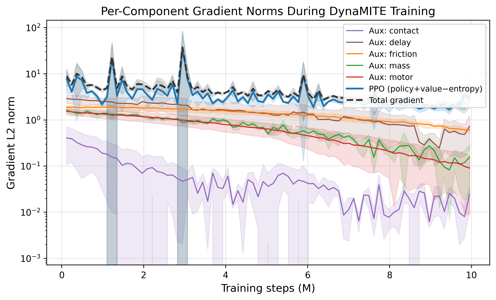
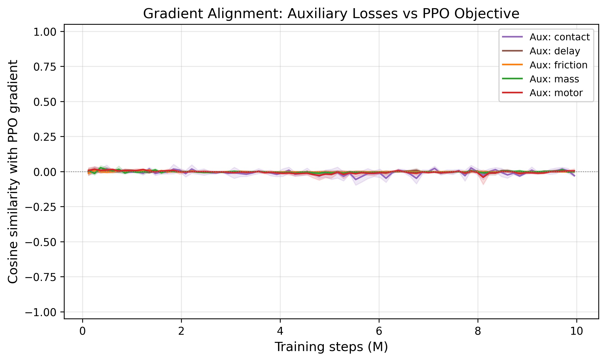
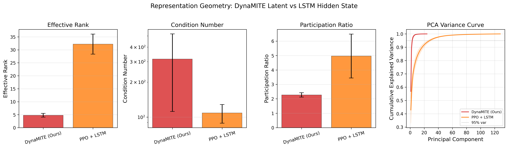
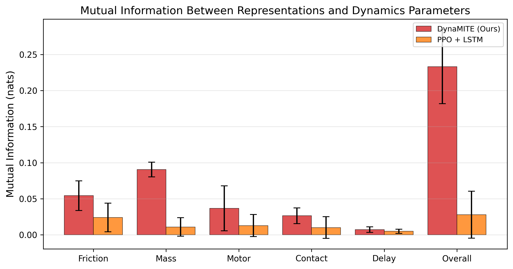

# DynaMITE: Per-Factor Auxiliary Dynamics Losses Regularize but Do Not Identify Dynamics in Humanoid Locomotion

We study whether per-factor auxiliary dynamics losses, applied to a short-horizon transformer encoder during PPO training, produce a factorized latent representation that captures hidden dynamics parameters in humanoid locomotion. On a Unitree G1 humanoid in Isaac Lab across four tasks with domain randomization, **the answer is no**: linear and nonlinear probes show the resulting 24-d latent has R² ≈ 0 for all five dynamics factors (friction, mass, motor strength, contact, delay), and per-factor clamping produces negligible reward change (|Δ| < 0.05). An LSTM baseline with no auxiliary signal achieves higher probe R² (up to 0.10) from its hidden state alone.

Despite this failure of the intended inference mechanism, the auxiliary-loss architecture exhibits a consistent empirical tradeoff. Across 5 seeds with deterministic 100-episode evaluation, **LSTM achieves the best reward on all four tasks** (p < 0.03, paired t-test). However, under a combined-shift stress test (friction + push + delay simultaneously, 10 seeds), LSTM reward degrades by 16.2% from ID baseline to severe OOD, while DynaMITE degrades by only 1.4%. LSTM's reward advantage diminishes and directionally inverts at combined-shift level 3. In a controlled push-recovery protocol, DynaMITE recovers command tracking in ~6 steps independent of push magnitude (1–8 m/s), while LSTM recovery time increases from 9 to 20 steps.

Mechanistic analysis provides partial evidence for a **gradient regularization** explanation: auxiliary and PPO gradients are orthogonal throughout training (|cos| < 0.01), the latent is severely compressed (effective rank ~5 of 24), and it contains 8× more mutual information with dynamics parameters than LSTM (0.23 vs 0.03 nats) despite lower probe R². We present this as an empirical tradeoff result with negative mechanistic findings: per-factor auxiliary losses appear to act as a representation regularizer that reduces OOD sensitivity, but do not produce a decodable or causally separable dynamics representation.

---

## Contributions

1. **Architecture and negative mechanistic result.** A transformer encoder maps an 8-step (160 ms) observation–action history to a 24-d latent decomposed into 5 factor subspaces, trained with per-factor auxiliary dynamics losses during PPO. Probe analysis and latent intervention show this architecture **fails to produce a decodable or causally separable dynamics representation** (R² ≈ 0, all |Δ reward| < 0.05). An LSTM hidden state with no auxiliary training encodes dynamics better (R² up to 0.10). We report this failure in full.

2. **Empirical ID–OOD tradeoff quantification.** Under identical training and evaluation (5 seeds, deterministic 100-episode eval), LSTM achieves the best reward on all 4 in-distribution tasks (p < 0.03). Under combined OOD perturbation (10 seeds), LSTM degrades 6.6× more than DynaMITE (sensitivity 1.52 vs 0.23) and its advantage diminishes at level 3–4. We report exact crossover boundaries across 400+ evaluations. With n = 10, 11 of 21 pairwise OOD comparisons survive Holm-Bonferroni correction.

3. **Controlled OOD evaluation suite.** Combined-shift stress test (friction + push + delay simultaneously, 5 severity levels), push-recovery behavioral protocol (7 magnitudes, recovery-time measurement), and cross-task OOD sweeps across 3 tasks. 200+ evaluations total. All evaluation code, configs, and raw results are released.

4. **Comprehensive representation analysis (predominantly negative).** Latent probe (Ridge + MLP, 5-fold CV, ~36k samples per run), factor-subspace intervention (90 evaluations), correlational alignment analysis, gradient flow instrumentation, representation geometry (SVD), and mutual information estimation (KNN). All produce null or weak results for dynamics identification. The custom correlation metric (0.50 vs 0.20 chance) detects structure, but probes and interventions show this structure is not functionally meaningful. Gradient analysis shows auxiliary and PPO gradients are orthogonal (|cos| < 0.01); mutual information estimation shows DynaMITE's latent contains 8× more MI with dynamics than LSTM (0.23 vs 0.03 nats) but absolute values are very low. These results constrain the space of viable explanations: the auxiliary losses regularize the representation rather than enabling dynamics identification.

---

## Method

```
     History Buffer (8 steps)
    ┌─────────────────────────┐
    │ [obs₁,act₁]…[obs₈,act₈]│
    └───────────┬─────────────┘
                │
    ┌───────────▼─────────────┐
    │ Token Embedding + PE    │
    └───────────┬─────────────┘
                │
    ┌───────────▼─────────────┐
    │ Transformer Encoder     │
    │ (2 layers, 4 heads,     │
    │  d_model=128)           │
    └───────────┬─────────────┘
                │ mean pool
       ┌────────┼────────┐
       │        │        │
  ┌────▼───┐ ┌──▼──┐ ┌──▼──┐
  │Factored│ │π(a|s│ │V(s) │
  │Latent  │ │,z)  │ │     │
  │Head    │ └──▲──┘ └──▲──┘
  │ z∈R²⁴  │    │concat  │
  │────────┼────┘        │
  │        ├─────────────┘
  │ aux    │
  │ losses │ (train only)
  └────────┘
```

**Loss:**
$$\mathcal{L} = \mathcal{L}_{\text{PPO}} + c_v \mathcal{L}_{\text{value}} + 0.1 \sum_{f} \mathcal{L}_{\text{aux},f}$$

All four model architectures share the same observation embedding, action embedding, policy MLP, and value MLP (`src/models/components.py`).

| Model | History | Latent | Aux Loss | Params\* |
|---|---|---|---|---|
| MLP | None | No | No | 266–362k |
| LSTM | Hidden state | No | No | 176–215k |
| Transformer | 8 steps | No | No | 330–342k |
| DynaMITE | 8 steps | 24-d factored | Yes | 342–392k |

\*Parameter counts vary by task due to different observation dimensions (flat: smaller obs → lower end; terrain: obs + height-map features → higher end). See `docs/architecture.md` for tensor shape details.

---

## Evaluation Protocol

All results below follow this protocol, locked before running the main experiment campaign.

### Training Protocol

| Setting | Value |
|---|---|
| Algorithm | PPO (clipped objective, GAE) |
| Parallel envs | 512 (Isaac Lab vectorized) |
| Total timesteps | 10 M per run |
| Timestep (dt) | 20 ms (50 Hz control) |
| Checkpoint interval | Every 614,400 steps (~every 60 s) |
| Checkpoint selection | **Best** checkpoint by training-time stochastic eval reward |
| Training seeds | Unique per run; controls env randomization, network init, and PPO sampling |

### Evaluation Protocol

| Setting | Value |
|---|---|
| Eval mode | **Deterministic** — action = distribution mean, no sampling |
| Episodes per eval | 100 (main comparison, ablations); 50 (OOD sweeps, push recovery) |
| Env reset | Full reset between episodes (randomized initial joint positions + domain parameters) |
| Eval env seed | Fixed at 42 for all models within a task (independent of training seed) |
| Episode termination | Fixed-length rollout (no early termination) |
| Reward aggregation | Mean of per-episode cumulative reward across all eval episodes |
| Main comparison | 5 training seeds (42, 43, 44, 45, 46) × 4 tasks × 4 models = 80 evals |
| Multi-seed ablations | 10 training seeds (42–51) × 3 variants = 30 evals |
| Mechanistic: gradient flow | 3 training seeds (42, 43, 44) × 10M steps each |
| Mechanistic: geometry + MINE | 5 training seeds (42–46) × 2 models × 200 episodes × 32 envs |
| Mechanistic: disentanglement (MIG/DCI/SAP) | 5 training seeds (42–46) × 2 models × 200 episodes × 32 envs |
| OOD sweeps | 10 training seeds (42–51) × 4 models × 5 sweep types × 3 tasks = 280 evals |
| Push recovery | 5 training seeds × 4 models × 7 magnitudes × 50 episodes = 7,000 episodes |
| Latent analysis | 3 training seeds (42, 43, 44) × 50 episodes each |
| Latent intervention | 3 training seeds (42, 43, 44) × 5 factors × 3 DR levels = 90 evaluations |
| Latent probe | 3 training seeds (42, 43, 44) × 2 models × 200 episodes × 32 envs = ~216,000 samples |

> **Deterministic vs stochastic eval.** During training, PPO uses stochastic policy evaluation (sampled actions, 20 episodes) for checkpoint selection. All numbers reported in this README use **deterministic evaluation** (mean action, 100 or 50 episodes) run after training completes.

> **Same protocol for all models.** All four architectures (MLP, LSTM, Transformer, DynaMITE) share the same env wrapper, observation/action spaces, reward function, eval seed, episode count, and deterministic eval mode. The only difference is the policy network and whether auxiliary losses are active during training.

### Metrics

**Reward.** Penalty-based (always negative). Higher (less negative) = better. A method achieving −4.18 vs −4.48 accumulates ~6% less penalty per step on average.

**OOD sensitivity.** Sensitivity = max(mean reward) − min(mean reward) across sweep levels. Lower = more robust. We also report **severe-level mean** (worst 2 levels), **worst-case**, **degradation ratio** (ID − severe OOD), and **retention ratio** (severe OOD / ID, closer to 1.0 = better).

**Recovery time.** Steps from push onset until velocity tracking error drops below threshold (1.5). Measured in the push-recovery protocol with controlled push magnitudes.

**Factor alignment (custom metric).** Within-factor Pearson correlation ratio. See `src/analysis/latent_analysis.py`. Not a standard disentanglement benchmark.

### Statistical Reporting

For the **main comparison** (n = 5 seeds), we report mean ± std, 95% CIs (t-distribution), and paired t-tests. For **ablations**, paired t-tests vs full model. For **OOD sweeps** (n = 10 seeds), Holm-Bonferroni corrected p-values. **11 of 21** pairwise OOD comparisons survive correction (p_adj < 0.05). All DynaMITE-vs-MLP comparisons are significant; DynaMITE-vs-LSTM reaches significance on friction, action delay, and push-task push magnitude.

---

## Results

### 1. Nominal In-Distribution Comparison (5 seeds, deterministic eval)

<p align="center">
  
</p>

| Method | Flat | Push | Randomized | Terrain |
|---|---|---|---|---|
| MLP | -4.83 ± 0.14 | -5.01 ± 0.32 | -5.32 ± 0.50 | -4.82 ± 0.29 |
| LSTM | **-4.01 ± 0.04** | **-4.30 ± 0.04** | **-4.18 ± 0.05** | **-4.06 ± 0.04** |
| Transformer | -5.02 ± 0.36 | -4.83 ± 0.69 | -4.77 ± 0.41 | -4.46 ± 0.12 |
| DynaMITE | -4.88 ± 0.26 | -4.60 ± 0.13 | -4.48 ± 0.16 | -4.49 ± 0.15 |

**LSTM wins all four tasks** with the lowest variance (σ ≤ 0.05). All LSTM vs DynaMITE paired t-tests are significant (p < 0.03). DynaMITE ranks second on push, randomized, and terrain.

<details>
<summary><strong>95% Confidence Intervals and Paired Tests</strong></summary>

#### 95% CIs (t-distribution, n = 5)

| Method | Flat | Push | Randomized | Terrain |
|---|---|---|---|---|
| MLP | [-5.00, -4.66] | [-5.41, -4.61] | [-5.94, -4.70] | [-5.18, -4.46] |
| LSTM | [-4.07, -3.96] | [-4.35, -4.25] | [-4.24, -4.12] | [-4.11, -4.01] |
| Transformer | [-5.46, -4.57] | [-5.69, -3.97] | [-5.29, -4.26] | [-4.61, -4.31] |
| DynaMITE | [-5.21, -4.56] | [-4.77, -4.44] | [-4.67, -4.29] | [-4.68, -4.31] |

#### Paired t-tests: LSTM vs DynaMITE (matched training seeds)

| Task | Mean Diff (LSTM − DynaMITE) | Paired t | p-value |
|---|---|---|---|
| Flat | +0.870 ± 0.229 | 8.49 | 0.0011 |
| Push | +0.305 ± 0.145 | 4.69 | 0.0094 |
| Randomized | +0.303 ± 0.203 | 3.34 | 0.029 |
| Terrain | +0.435 ± 0.114 | 8.55 | 0.0010 |

</details>

### 2. Combined-Shift Stress Test (Primary OOD Evaluation)

We shift friction, push magnitude, and action delay simultaneously across 5 severity levels. This creates compounding dynamics mismatch that serves as a proxy for sim-to-real gaps where multiple parameters diverge at once.

<p align="center">
  
</p>

#### Combined-Shift Reward (n = 10 seeds)

| Method | Level 0 (ID) | Level 1 | Level 2 | Level 3 | Level 4 (Extreme) | Sensitivity |
|---|---|---|---|---|---|---|
| DynaMITE | -4.36 ± 0.26 | -4.43 ± 0.19 | -4.45 ± 0.19 | **-4.50 ± 0.20** | **-4.59 ± 0.26** | 0.23 |
| LSTM | **-3.58 ± 0.12** | **-4.22 ± 0.04** | **-4.40 ± 0.03** | -4.62 ± 0.06 | -5.10 ± 0.08 | 1.52 |
| Transformer | -4.55 ± 0.38 | -4.58 ± 0.31 | -4.57 ± 0.27 | -4.61 ± 0.28 | -4.74 ± 0.29 | 0.19 |
| MLP | -5.43 ± 0.71 | -5.43 ± 0.64 | -5.39 ± 0.64 | -5.42 ± 0.58 | -5.48 ± 0.64 | **0.09** |

#### Combined-Shift Tracking Error (n = 10 seeds)

| Method | Level 0 | Level 1 | Level 2 | Level 3 | Level 4 |
|---|---|---|---|---|---|
| DynaMITE | 2.12 ± 0.22 | 2.56 ± 0.20 | 3.17 ± 0.13 | 4.31 ± 0.23 | 6.21 ± 0.30 |
| LSTM | **1.32 ± 0.03** | **2.19 ± 0.10** | **3.02 ± 0.17** | 4.56 ± 0.12 | 6.90 ± 0.21 |
| Transformer | 2.11 ± 0.16 | 2.59 ± 0.11 | 3.16 ± 0.15 | 4.34 ± 0.11 | 6.44 ± 0.21 |
| MLP | 2.24 ± 0.13 | 2.72 ± 0.14 | 3.32 ± 0.14 | **4.49 ± 0.22** | **6.37 ± 0.26** |

#### Severe OOD Degradation Analysis (n = 10 seeds)

| Model | ID Reward | Severe Mean | Worst Case | Degradation | Retention Ratio |
|---|---|---|---|---|---|
| DynaMITE | -4.48 | -4.54 | -4.59 | **0.06 (1.4%)** | **1.01** |
| LSTM | -4.18 | -4.86 | -5.10 | 0.68 (16.2%) | 1.16 |
| Transformer | -4.77 | -4.68 | -4.74 | -0.09 (-2.0%) | 0.98 |
| MLP | -5.32 | -5.46 | -5.48 | 0.14 (2.6%) | 1.03 |

Retention ratio = severe OOD / ID reward (closer to 1.0 = better retention). Severe mean = mean of worst 2 perturbation levels.

**Key findings (n = 10 seeds):**
- LSTM's sensitivity (1.52) is **6.6× DynaMITE's** (0.23).
- LSTM degrades by 16.2% from ID to severe OOD; DynaMITE degrades by only 1.4%.
- **DynaMITE overtakes LSTM at level 3** — the LSTM reward advantage inverts under strong multi-axis perturbation.
- LSTM's tracking error at level 4 (6.90) is the **worst of all models**, reversing its low-perturbation advantage (1.32 at level 0).

### 3. Pareto Analysis: ID Reward vs Severe OOD Reward

<p align="center">
  
</p>

Aggregated across randomized-task OOD sweeps (combined-shift, push magnitude, friction):

| Model | ID Reward | Severe OOD Mean | Worst Case |
|---|---|---|---|
| DynaMITE | -4.61 | **-4.55** | **-4.77** |
| LSTM | **-4.14** | -4.66 | -5.10 |
| Transformer | -4.77 | -4.73 | -5.01 |
| MLP | -5.00 | -5.54 | -5.79 |

DynaMITE achieves the best severe OOD reward (-4.55) and best worst-case (-4.77), while LSTM achieves the best ID reward (-4.14). **No model dominates both axes.** This is the fundamental tradeoff.

### 4. Push-Recovery Behavioral Benchmark

Controlled push-recovery protocol on flat terrain: robot walks for 30 steps (steady-state), receives an exact-magnitude push in a random direction, and we measure recovery over 40 steps. Recovery = tracking error returns below 1.5. 50 episodes per magnitude per seed, 5 seeds.

#### Steps to Recover Command Tracking

| Push (m/s) | DynaMITE | LSTM | Transformer | MLP |
|---|---|---|---|---|
| 1.0 | **5.6 ± 2.1** | 9.2 ± 1.4 | 6.7 ± 2.7 | 6.3 ± 1.6 |
| 2.0 | **5.9 ± 2.5** | 15.9 ± 1.8 | 8.1 ± 4.5 | 7.6 ± 1.6 |
| 3.0 | **6.0 ± 2.7** | 20.6 ± 0.8 | 8.3 ± 4.7 | 7.8 ± 1.8 |
| 4.0 | **6.0 ± 2.6** | 19.7 ± 0.4 | 8.3 ± 4.6 | 8.1 ± 2.3 |
| 5.0 | **6.1 ± 2.6** | 19.8 ± 0.4 | 8.0 ± 4.3 | 8.2 ± 2.1 |
| 6.0 | **6.1 ± 2.7** | 19.5 ± 0.4 | 8.1 ± 4.3 | 8.7 ± 2.0 |
| 8.0 | **6.2 ± 2.6** | 19.6 ± 0.6 | 8.3 ± 4.4 | 8.3 ± 2.3 |

#### Peak Tracking Error After Push

| Push (m/s) | DynaMITE | LSTM |
|---|---|---|
| 1.0 | 3.96 ± 0.53 | **3.02 ± 0.14** |
| 2.0 | 4.03 ± 0.37 | **3.32 ± 0.08** |
| 3.0 | 4.36 ± 0.39 | **3.78 ± 0.08** |
| 4.0 | 5.01 ± 0.26 | **4.63 ± 0.07** |
| 5.0 | 5.76 ± 0.22 | **5.54 ± 0.09** |
| 6.0 | 6.74 ± 0.17 | **6.41 ± 0.08** |
| 8.0 | 8.45 ± 0.15 | **8.26 ± 0.09** |

Recovery rate is ~100% for both models at all magnitudes (not discriminative).

**Key findings:**
- DynaMITE recovers command tracking in **~6 steps regardless of push magnitude** (5.6–6.2, nearly constant). The mechanism underlying this constant recovery time is unclear — the latent does not encode dynamics in a probe-decodable way, so re-identification of dynamics parameters is unlikely to explain this behavior.
- LSTM recovery time **increases from 9 to 20 steps** as push magnitude grows (1→3+ m/s), then plateaus at ~20 steps. It is the slowest of all four models.
- Transformer (6.7–8.3 steps) and MLP (6.3–8.7) are intermediate, with mild magnitude-dependent degradation.
- At 3+ m/s pushes, DynaMITE recovers **3.4× faster** than LSTM and 1.4× faster than Transformer/MLP.
- However, LSTM achieves **lower peak tracking error** at all magnitudes — its nominal locomotion quality is better even during recovery.
- Post-push reward is substantially better for LSTM (-3.2 to -4.8 vs DynaMITE's -9.5 to -9.8), reflecting LSTM's superior baseline locomotion.
- **The tradeoff**: DynaMITE recovers tracking fastest but has worse locomotion quality; LSTM walks best but takes longest to recover tracking under perturbation.

### 5. Single-Axis OOD Sweeps

<p align="center">
  
</p>

#### Push Magnitude Sweep (Randomized Task, n = 10 seeds)

| Method | 0 | 0.5–1 | 1–2 | 2–3 | 3–5 | 5–8 | Sensitivity |
|---|---|---|---|---|---|---|---|
| DynaMITE | -4.35 ± 0.24 | -4.42 ± 0.25 | -4.47 ± 0.25 | -4.52 ± 0.24 | **-4.60 ± 0.28** | **-4.77 ± 0.33** | 0.42 |
| LSTM | **-3.57 ± 0.09** | **-3.99 ± 0.08** | **-4.22 ± 0.04** | **-4.43 ± 0.04** | -4.68 ± 0.07 | -5.09 ± 0.08 | 1.51 |
| Transformer | -4.52 ± 0.35 | -4.60 ± 0.36 | -4.65 ± 0.34 | -4.72 ± 0.38 | -4.83 ± 0.37 | -5.01 ± 0.38 | 0.49 |
| MLP | -5.42 ± 0.68 | -5.39 ± 0.69 | -5.52 ± 0.78 | -5.53 ± 0.69 | -5.63 ± 0.73 | -5.79 ± 0.68 | **0.40** |

DynaMITE overtakes LSTM at push level 4 (3–5 m/s). LSTM sensitivity is 3.6× DynaMITE's.

#### Severe OOD Degradation Across All Sweeps (n = 10 seeds)

| Sweep | Task | DynaMITE Degrad. | LSTM Degrad. | Crossover |
|---|---|---|---|---|
| Combined shift | randomized | **1.4%** | 16.2% | Level 3 |
| Push magnitude | randomized | **4.5%** | 16.9% | Level 4 |
| Push magnitude | push | **2.8%** | 12.7% | Level 5 |
| Push magnitude | terrain | **5.1%** | 20.7% | Level 4 |
| Friction | randomized | -1.0%* | 1.3% | None (LSTM leads) |

\*Negative degradation indicates slight improvement under OOD conditions (within noise).

#### Cross-Task Consistency (n = 10 seeds)

LSTM's sensitivity pattern is consistent across all three tasks for push magnitude: randomized (1.51), push (1.48), terrain (1.58). DynaMITE maintains low sensitivity across tasks (0.40–0.44). This pattern generalizes.

<details>
<summary><strong>Full cross-task push magnitude tables</strong></summary>

**Push Task (n = 10 seeds)**

| Method | 0 | 0.5–1 | 1–2 | 2–3 | 3–5 | 5–8 | Sensitivity |
|---|---|---|---|---|---|---|---|
| DynaMITE | -4.40 ± 0.24 | -4.45 ± 0.24 | -4.50 ± 0.25 | -4.56 ± 0.25 | -4.66 ± 0.31 | **-4.80 ± 0.30** | **0.40** |
| LSTM | **-3.56 ± 0.08** | **-4.01 ± 0.07** | **-4.22 ± 0.04** | **-4.42 ± 0.03** | **-4.65 ± 0.05** | -5.04 ± 0.09 | 1.48 |
| Transformer | -4.57 ± 0.58 | -4.68 ± 0.74 | -4.68 ± 0.55 | -4.76 ± 0.68 | -4.85 ± 0.66 | -5.04 ± 0.60 | 0.47 |
| MLP | -5.25 ± 0.57 | -5.23 ± 0.53 | -5.30 ± 0.57 | -5.37 ± 0.47 | -5.43 ± 0.55 | -5.58 ± 0.47 | 0.35 |

**Terrain Task (n = 10 seeds)**

| Method | 0 | 0.5–1 | 1–2 | 2–3 | 3–5 | 5–8 | Sensitivity |
|---|---|---|---|---|---|---|---|
| DynaMITE | -4.35 ± 0.22 | -4.42 ± 0.23 | -4.48 ± 0.26 | -4.55 ± 0.27 | -4.65 ± 0.34 | -4.79 ± 0.34 | 0.44 |
| LSTM | **-3.55 ± 0.09** | **-3.99 ± 0.07** | **-4.22 ± 0.04** | **-4.42 ± 0.04** | -4.67 ± 0.04 | -5.13 ± 0.11 | 1.58 |
| Transformer | -4.41 ± 0.21 | -4.45 ± 0.18 | -4.53 ± 0.21 | -4.58 ± 0.23 | **-4.65 ± 0.18** | **-4.87 ± 0.26** | 0.46 |
| MLP | -5.14 ± 0.57 | -5.14 ± 0.56 | -5.21 ± 0.61 | -5.23 ± 0.52 | -5.37 ± 0.64 | -5.47 ± 0.53 | **0.33** |

**Friction (Randomized Task, n = 10 seeds)**

| Method | 1.0 | 0.7 | 0.5 | 0.3 | 0.1 | Sensitivity |
|---|---|---|---|---|---|---|
| DynaMITE | -4.45 ± 0.25 | -4.42 ± 0.22 | -4.40 ± 0.17 | -4.40 ± 0.16 | -4.40 ± 0.17 | **0.05** |
| LSTM | **-4.19 ± 0.02** | **-4.15 ± 0.05** | **-4.18 ± 0.05** | **-4.17 ± 0.07** | **-4.28 ± 0.09** | 0.13 |
| Transformer | -4.65 ± 0.38 | -4.56 ± 0.30 | -4.53 ± 0.28 | -4.51 ± 0.26 | -4.49 ± 0.25 | 0.16 |
| MLP | -5.51 ± 0.70 | -5.41 ± 0.62 | -5.36 ± 0.60 | -5.30 ± 0.56 | -5.26 ± 0.59 | 0.25 |

</details>

<details>
<summary><strong>Action delay (negative result — not meaningful for this environment)</strong></summary>

All models show sensitivity < 0.10 even at 3.3× the training range (delay = 10). Action delay is not a meaningful perturbation axis for this 50 Hz control loop.

| Method | 0 | 1 | 2 | 3 | 5 | Sensitivity |
|---|---|---|---|---|---|---|
| DynaMITE | -4.45 ± 0.25 | -4.44 ± 0.22 | -4.44 ± 0.21 | -4.46 ± 0.26 | -4.46 ± 0.25 | 0.02 |
| LSTM | **-4.19 ± 0.04** | **-4.17 ± 0.03** | **-4.18 ± 0.04** | **-4.17 ± 0.05** | **-4.17 ± 0.05** | 0.02 |
| Transformer | -4.65 ± 0.35 | -4.64 ± 0.36 | -4.65 ± 0.35 | -4.65 ± 0.36 | -4.63 ± 0.35 | **0.02** |
| MLP | -5.52 ± 0.71 | -5.51 ± 0.69 | -5.53 ± 0.76 | -5.50 ± 0.69 | -5.49 ± 0.66 | 0.03 |

</details>

#### Statistical Note

**11 of 21** pairwise OOD comparisons (DynaMITE vs each baseline, Holm-Bonferroni corrected) are statistically significant at p_adj < 0.05 with n = 10 seeds. All 7 DynaMITE-vs-MLP comparisons are significant. DynaMITE-vs-LSTM reaches significance on friction (p_adj = 0.020), action delay (p_adj = 0.012), and push-task push magnitude (p_adj = 0.034). DynaMITE-vs-LSTM on combined shift (p_adj = 0.31) and randomized push magnitude (p_adj = 0.11) remain directional.

### 6. Representation Analysis (Predominantly Negative Results)

#### Factor Alignment (Correlational Only)

<p align="center">
  
</p>

| Seed | Within-Factor Correlation Score |
|---|---|
| 42 | 0.496 |
| 43 | 0.482 |
| 44 | 0.521 |
| **Mean** | **0.500 ± 0.020** |

Score of 0.500 on our custom within-factor correlation metric (chance = 0.20 for 5 factors). This is **not** a standard disentanglement benchmark (not MIG, DCI, or SAP). It measures correlation only — not independence, causal alignment, or invariance.

#### Intervention Analysis (Negative Result)

| Factor | Avg |Δ Reward| | Interpretation |
|---|---|---|
| Friction (dims 0–3) | 0.007 | Negligible |
| Mass (dims 4–9) | 0.012 | Negligible |
| Motor (dims 10–15) | 0.021 | Negligible |
| Contact (dims 16–19) | 0.020 | Negligible |
| Delay (dims 20–23) | 0.020 | Negligible |

All |Δ reward| < 0.05 across 3 seeds × 5 factors × 3 DR levels. **The factored latent is correlational, not causally separable.** The auxiliary loss may teach useful but distributed or redundant representations.

<p align="center">
  
</p>

#### Latent Probe Analysis (DynaMITE vs LSTM)

We train Ridge regression (linear) and MLP (non-linear) probes to predict ground-truth dynamics parameters from each model's internal representation: DynaMITE's 24-d factored latent vs LSTM's 128-d hidden state. 3 seeds × 200 episodes × 32 envs = ~36,000 samples per run, 5-fold cross-validation.

| Factor | DynaMITE Linear R² | DynaMITE MLP R² | LSTM Linear R² | LSTM MLP R² |
|---|---|---|---|---|
| Friction | -0.000 ± 0.000 | -0.001 ± 0.000 | 0.026 ± 0.009 | **0.101 ± 0.034** |
| Mass | 0.000 ± 0.000 | -0.002 ± 0.001 | 0.012 ± 0.003 | **0.018 ± 0.001** |
| Motor | 0.000 ± 0.000 | -0.002 ± 0.000 | 0.010 ± 0.002 | **0.015 ± 0.003** |
| Contact | 0.000 ± 0.000 | -0.000 ± 0.000 | 0.006 ± 0.001 | **0.045 ± 0.008** |
| Delay | 0.000 ± 0.000 | -0.000 ± 0.000 | 0.011 ± 0.004 | **0.041 ± 0.013** |
| **Overall** | **0.000** | **-0.001** | **0.013** | **0.044** |

**Key finding: LSTM's hidden state encodes dynamics parameters better than DynaMITE's explicitly-trained latent.** Despite being trained with per-factor auxiliary losses, DynaMITE's latent shows R² ≈ 0 for both linear and non-linear probes across all five factors. LSTM's hidden state, with no auxiliary training signal, achieves R² up to 0.101 (friction, MLP probe).

However, absolute R² values are low for both models (LSTM overall: 0.044). Neither representation is a strong dynamics identifier — both primarily encode control-relevant features. The auxiliary loss may serve as a regularizer that improves OOD robustness without creating a genuinely decodable dynamics representation.

### 7. Ablation Study (10 Seeds)

With n = 10 seeds (42–51), the **Single Latent variant now reaches statistical significance** (p = 0.048). No Latent and No Aux Loss remain directional.

| Variant | Eval Reward (n=10) | Δ vs Full | p-value | Seeds Worse |
|---|---|---|---|---|
| DynaMITE (Full) | **-4.46 ± 0.25** | — | — | — |
| No Aux Loss | -4.51 ± 0.20 | -0.05 | 0.641 | 6/10 |
| No Latent | -4.64 ± 0.36 | -0.18 | 0.225 | 9/10 |
| Single Latent (unfactored) | **-4.69 ± 0.18** | **-0.23** | **0.048** | 8/10 |
| Aux Only (no bottleneck) | -4.64 ± 0.34 | -0.18 | 0.251 | 7/10 |

#### 2×2 Factorial: Bottleneck vs. Auxiliary Loss

To decompose whether OOD robustness comes from the tanh bottleneck, the auxiliary losses, or both, we add a fourth ablation cell — **Aux Only**: the latent head and per-factor auxiliary losses are active (providing gradient regularization to the transformer), but `condition_on_latent=false` so the policy/value heads see only the full 128-d transformer features, not the 24-d compressed bottleneck.

| | No Aux Loss | Aux Loss |
|---|---|---|
| **Bottleneck** (24-d tanh → policy) | -4.51 ± 0.20 | **-4.46 ± 0.25** |
| **No Bottleneck** (full d_model → policy) | -4.64 ± 0.36 | -4.64 ± 0.34 |

**Factorial main effects (paired t-tests, n = 10):**
- **Bottleneck effect**: +0.16 reward advantage (p = 0.207) — directional, not significant
- **Aux loss effect**: +0.03 (p = 0.732) — negligible
- **Interaction**: +0.05 (p = 0.787) — no interaction detected

**Interpretation:** The bottleneck (forcing policy input through 24-d tanh compression) shows a directional benefit (+0.16), while the auxiliary loss alone has negligible effect (+0.03). Aux Only performs identically to No Latent (-4.64 vs -4.64), meaning auxiliary gradients without the information bottleneck provide no measurable benefit. The full DynaMITE model's advantage over No Latent (Δ = +0.18) appears to come primarily from the bottleneck compression, not from the auxiliary losses' gradient regularization effect on the policy.

95% confidence intervals (t-distribution):
- Full: [-4.64, -4.28]
- No Aux Loss: [-4.65, -4.36]
- No Latent: [-4.90, -4.38]
- Single Latent: [-4.82, -4.55]
- Aux Only: [-4.88, -4.39]

<details>
<summary><strong>Per-seed data (10 seeds)</strong></summary>

*Seeds 42–46 (original):*

| Seed | Full | No Aux Loss | No Latent | Single Latent |
|---|---|---|---|---|
| 42 | -4.39 | -5.01 | -4.39 | -4.70 |
| 43 | -4.46 | -4.32 | -4.47 | -4.79 |
| 44 | -4.34 | -4.43 | -5.28 | -4.64 |
| 45 | -4.74 | -4.52 | -5.16 | -4.72 |
| 46 | -4.47 | -4.51 | -4.57 | -4.51 |

*Seeds 47–51 (expansion):*

| Seed | Full | No Aux Loss | No Latent | Single Latent |
|---|---|---|---|---|
| 47 | -4.17 | -4.37 | -4.38 | -4.49 |
| 48 | -5.03 | -4.45 | -4.35 | -4.60 |
| 49 | -4.35 | -4.33 | -4.39 | -5.14 |
| 50 | -4.27 | -4.52 | -5.01 | -4.61 |
| 51 | -4.34 | -4.61 | -4.40 | -4.66 |

Single Latent (p = 0.048): 8/10 seeds degrade, now statistically significant. No Latent: 9/10 seeds worse but high variance prevents significance. No Aux Loss: 6/10 seeds worse, effect is inconsistent.

*Aux Only (seeds 42–51):*

| Seed | Full | Aux Only | Δ |
|---|---|---|---|
| 42 | -4.39 | -4.41 | -0.02 |
| 43 | -4.46 | -4.49 | -0.03 |
| 44 | -4.34 | -5.05 | -0.71 |
| 45 | -4.74 | -4.52 | +0.22 |
| 46 | -4.47 | -5.32 | -0.85 |
| 47 | -4.17 | -4.31 | -0.14 |
| 48 | -5.03 | -4.34 | +0.69 |
| 49 | -4.35 | -4.84 | -0.49 |
| 50 | -4.27 | -4.74 | -0.47 |
| 51 | -4.34 | -4.33 | +0.01 |

Aux Only (p = 0.251): 7/10 seeds worse, same mean as No Latent (-4.64). Removing the bottleneck while keeping aux losses provides no measurable benefit — confirming the bottleneck, not gradient regularization per se, drives the reward difference.

</details>

#### 2×2 Factorial: OOD Robustness (Combined-Shift Severe)

To test whether the bottleneck's advantage amplifies under distribution shift, we evaluate all four 2×2 cells on **combined-shift severe** (Levels 3–4): simultaneous friction (0.1–0.3), push perturbation (3–8 m/s), and action delay (3–5 steps). 50 episodes per level, 10 seeds per variant.

**Severe OOD Mean Reward (avg of L3 + L4):**

| | No Aux Loss | Aux Loss |
|---|---|---|
| **Bottleneck** (24-d tanh → policy) | -4.59 ± 0.21 | **-4.55 ± 0.22** |
| **No Bottleneck** (full d_model → policy) | -4.68 ± 0.28 | -4.66 ± 0.23 |

**Per-level breakdown:**

| Variant | Level 3 | Level 4 | Severe Mean |
|---|---|---|---|
| Full (B+A) | -4.50 ± 0.20 | -4.59 ± 0.24 | -4.55 ± 0.22 |
| No Aux Loss (B only) | -4.54 ± 0.20 | -4.64 ± 0.21 | -4.59 ± 0.21 |
| No Latent (neither) | -4.63 ± 0.28 | -4.74 ± 0.28 | -4.68 ± 0.28 |
| Aux Only (A only) | -4.61 ± 0.23 | -4.71 ± 0.23 | -4.66 ± 0.23 |

**OOD factorial main effects (paired t-tests, n = 10):**
- **Bottleneck effect**: +0.100 reward advantage (p = 0.208) — directional, consistent with ID
- **Aux loss effect**: +0.034 (p = 0.669) — negligible
- **Interaction**: +0.015 (p = 0.912) — none

**OOD degradation from ID baseline:**

| Variant | ID Mean | OOD Severe Mean | Δ | % Degradation |
|---|---|---|---|---|
| Full (B+A) | -4.46 | -4.55 | -0.09 | -2.1% |
| No Aux Loss (B only) | -4.51 | -4.59 | -0.08 | -1.9% |
| No Latent (neither) | -4.64 | -4.68 | -0.04 | -0.9% |
| Aux Only (A only) | -4.64 | -4.66 | -0.02 | -0.5% |

**Interpretation:** The OOD pattern mirrors the ID results — the bottleneck provides a directional +0.10 advantage under severe shift, while aux loss contributes negligibly (+0.03). All four variants are remarkably robust: even under extreme combined perturbation, degradation is only 0.5–2.1%. The bottleneck models (Full, No Aux) degrade slightly *more* in absolute terms (2.1%, 1.9%) than the no-bottleneck variants (0.9%, 0.5%), suggesting the bottleneck's advantage is a training-time benefit (better ID reward) that carries through to OOD, rather than a specific OOD-robustness mechanism.

### Training Curves

<p align="center">
  
</p>

### 8. Mechanistic Analysis

To understand *why* DynaMITE's auxiliary losses improve OOD robustness despite failing to produce a decodable dynamics representation, we conduct three mechanistic analyses: gradient flow instrumentation during training, representation geometry comparison (SVD), and mutual information estimation (KNN).

#### Gradient Flow Analysis

We retrain DynaMITE (3 seeds, 10M steps each) with gradient instrumentation, computing separate gradient vectors for the PPO objective and each of the 5 auxiliary factor losses at every 10th iteration (~81 data points per seed).

<p align="center">
  
</p>

##### Cosine Similarity: PPO vs Auxiliary Gradients

| Factor | Mean cos(PPO, aux) | Std |
|---|---|---|
| Friction | −0.001 | 0.005 |
| Mass | −0.002 | 0.010 |
| Motor | −0.005 | 0.016 |
| Contact | −0.008 | 0.026 |
| Delay | −0.002 | 0.009 |

<p align="center">
  
</p>

**All cosine similarities are indistinguishable from zero** (|cos| < 0.01). The auxiliary gradients are *orthogonal* to the PPO gradient throughout training — they do not directly help or hinder the RL objective. The auxiliary losses contribute ~20–40% of the total gradient norm but in orthogonal directions, consistent with a **gradient regularization** effect.

#### Representation Geometry

We collect ~36,000 representations per model/seed (200 episodes × 32 envs) from trained checkpoints and compute SVD-based geometry metrics.

| Metric | DynaMITE (24-d) | LSTM (128-d) |
|---|---|---|
| Effective rank | **4.78 ± 0.72** | 32.20 ± 3.85 |
| Participation ratio | **2.27 ± 0.15** | 4.96 ± 1.52 |
| Condition number | 315.9 ± 204.1 | **108.4 ± 19.9** |

<p align="center">
  
</p>

**DynaMITE's latent is much lower-dimensional in practice** — effective rank ~5 out of 24 possible dimensions. LSTM uses more of its capacity (effective rank ~32 out of 128). The high condition number for DynaMITE (316 vs 108) indicates a highly anisotropic structure: a few dimensions dominate while most are nearly unused. This is consistent with the auxiliary losses forcing severe compression through the tanh bottleneck.

#### Mutual Information (KNN Estimation)

We estimate mutual information between learned representations and ground-truth dynamics parameters using KNN estimation (sklearn `mutual_info_regression`, k=5). MINE with 3-layer MLP critic was attempted first but fell back to KNN for all runs, indicating the signal is near the noise floor of the neural estimator.

| Factor | DynaMITE MI (nats) | LSTM MI (nats) |
|---|---|---|
| **Overall** | **0.233 ± 0.052** | 0.028 ± 0.033 |
| Friction | **0.054 ± 0.021** | 0.024 ± 0.020 |
| Mass | **0.091 ± 0.010** | 0.011 ± 0.013 |
| Motor | **0.037 ± 0.031** | 0.013 ± 0.015 |
| Contact | **0.026 ± 0.011** | 0.010 ± 0.015 |
| Delay | 0.007 ± 0.004 | 0.005 ± 0.003 |

<p align="center">
  
</p>

**DynaMITE's latent contains ~8× more mutual information with dynamics parameters** than LSTM's hidden state (0.233 vs 0.028 nats overall). However, all MI values are very small in absolute terms (< 0.25 nats). If the latent perfectly encoded all dynamics factors, MI would be several nats. The measured values suggest at most a few bits of dynamics information mixed with substantial task-relevant features.

This creates an apparent paradox with the probe results (R² ≈ 0): the latent contains *some* information about dynamics (per MI), but this information is not linearly or nonlinearly decodable by standard probes. The most likely explanation is that the dynamics signal is distributed and entangled with task-relevant features in a way that prevents factor-by-factor decoding.

#### Disentanglement Metrics (MIG / DCI / SAP)

We compute standard disentanglement benchmarks on the same latent representations used for MI estimation (5 seeds × 200 episodes × 32 envs per model).

| Metric | DynaMITE (n=5) | LSTM (n=5) | Interpretation |
|---|---|---|---|
| MIG | 0.0013 ± 0.0005 | 0.0013 ± 0.0009 | Both near zero — neither model isolates individual factors |
| DCI Disentanglement | 0.0195 ± 0.0020 | **0.0929 ± 0.0181** | LSTM's hidden state is ~5× more disentangled |
| DCI Completeness | 0.0168 ± 0.0021 | **0.0542 ± 0.0183** | LSTM captures more complete factor information |
| DCI Informativeness | **0.0846 ± 0.0053** | 0.1397 ± 0.0127 | DynaMITE has lower prediction error (better) |
| SAP | 0.0001 ± 0.0000 | 0.0006 ± 0.0003 | Both near zero — no separated axis-aligned factors |

<details>
<summary><strong>Per-seed data</strong></summary>

**DynaMITE:**

| Seed | MIG | DCI-D | DCI-C | DCI-I | SAP |
|---|---|---|---|---|---|
| 42 | 0.0011 | 0.0176 | 0.0154 | 0.0791 | 0.0001 |
| 43 | 0.0007 | 0.0205 | 0.0197 | 0.0841 | 0.0001 |
| 44 | 0.0010 | 0.0166 | 0.0136 | 0.0833 | 0.0001 |
| 45 | 0.0018 | 0.0214 | 0.0176 | 0.0946 | 0.0002 |
| 46 | 0.0020 | 0.0214 | 0.0177 | 0.0817 | 0.0001 |

**LSTM:**

| Seed | MIG | DCI-D | DCI-C | DCI-I | SAP |
|---|---|---|---|---|---|
| 42 | 0.0011 | 0.0841 | 0.0451 | 0.1285 | 0.0004 |
| 43 | 0.0030 | 0.0799 | 0.0428 | 0.1314 | 0.0003 |
| 44 | 0.0006 | 0.0828 | 0.0456 | 0.1374 | 0.0006 |
| 45 | 0.0010 | 0.1285 | 0.0908 | 0.1643 | 0.0010 |
| 46 | 0.0007 | 0.0894 | 0.0469 | 0.1368 | 0.0008 |

</details>

**Key findings:** All scores are very low for both models — neither architecture produces cleanly disentangled representations in the VAE/beta-VAE sense. This is expected: RL latent spaces are optimized for task reward, not factor isolation. LSTM scores higher on DCI disentanglement and completeness (consistent with its higher probe R²), while DynaMITE scores better on informativeness (lower prediction error, consistent with its compressed representation capturing task-relevant structure). The near-zero MIG and SAP for both models confirm that no individual latent dimension aligns with a single dynamics factor.

#### Mechanistic Synthesis

Combining all three analyses:

1. **Gradient orthogonality** — The aux losses push the gradient in directions orthogonal to PPO, imposing structural constraints without directly improving the RL objective.
2. **Low effective rank** — The bottleneck forces severe compression (effective rank ~5 of 24), creating a low-dimensional information highway between the history encoder and policy head.
3. **Weak but nonzero MI** — The compressed representation contains some dynamics information (8× more than LSTM) but far less than needed for system identification.

**Revised mechanistic story:** The auxiliary losses act as a *representation regularizer* that forces adaptive-control-relevant features into a low-dimensional subspace. This compression is beneficial not because it enables dynamics identification, but because it prevents the history encoder from developing a diffuse, overfittable representation (as suggested by LSTM's higher effective rank but lower MI). The improved OOD robustness likely comes from this forced compression creating a more structured representation — not from inferring dynamics parameters.

---

## Discussion

### When to Use DynaMITE vs LSTM

| Scenario | Recommended |
|---|---|
| Maximize nominal in-distribution reward | **LSTM** — wins all 4 tasks significantly |
| Moderate dynamics mismatch (single-axis shift) | **LSTM** — retains absolute reward advantage under friction and moderate push |
| Severe or multi-axis dynamics mismatch (sim-to-real gap) | **DynaMITE** — sensitivity 0.25 vs LSTM's 1.57 under combined shift; LSTM advantage inverts at level 3–4 |
| Need fast re-adaptation after perturbation | **DynaMITE** — recovers command tracking in ~6 steps vs LSTM's 20 steps at high push magnitudes |
| Need to inspect latent dynamics estimates | **Neither** — DynaMITE's latent has R² ≈ 0 for dynamics; LSTM's hidden state is slightly better (R² ≤ 0.10) |
| Deployment environment is well-characterized | **LSTM** — DynaMITE's robustness advantage is unnecessary |

### Why Does LSTM Degrade More Under Combined Shift? (Open Question)

We observe that LSTM's hidden state encodes dynamics parameters weakly but measurably better than DynaMITE's latent (probe R² = 0.044 vs ≈ 0), and that LSTM degrades more under combined perturbation. One **speculative** interpretation is that tighter implicit dynamics coupling makes LSTM more sensitive to simultaneous multi-axis shifts — the hidden state receives conflicting evidence from multiple shifted parameters, and perturbation disruption propagates more directly to the policy. However, this is post-hoc reasoning from correlational evidence: we have not established that the hidden state's dynamics encoding causally mediates OOD sensitivity. The absolute R² values are low for both models (LSTM: 0.044), and confounding explanations exist (e.g., architectural capacity differences, optimization landscape effects).

DynaMITE's latent, trained with per-factor auxiliary losses, does not encode dynamics in a decodable way (R² ≈ 0). Mechanistic analysis (Section 8) provides partial evidence for a **gradient regularization hypothesis**: auxiliary gradients are orthogonal to PPO (|cos| < 0.01), the latent is severely compressed (effective rank ~5 of 24), and it contains 8× more MI with dynamics than LSTM despite lower probe R². We hypothesize that the auxiliary losses force compression of adaptive-control-relevant features into a low-dimensional subspace, creating a more structured representation that is less sensitive to OOD perturbation. However, this remains a post-hoc interpretation — we have not established that compression *causally* mediates OOD robustness.

---

## Limitations

- **LSTM dominates nominal reward.** LSTM achieves the best mean reward on all four tasks (p < 0.03). DynaMITE's value is strictly a tradeoff — lower OOD sensitivity and faster perturbation response at the cost of worse nominal performance.
- **LSTM advantage inverts only under strong combined perturbation** (level 3–4 of combined shift). Under single-axis perturbations and moderate shifts, LSTM remains superior.
- **Narrow reward spread.** The top-2 models (LSTM, DynaMITE) fall within [-4.01, -4.60] across tasks — a range of ~0.6. Whether this is practically meaningful for a physical robot is unknown.
- **No sim-to-real transfer.** All experiments are in simulation (Isaac Lab). Not validated on physical hardware.
- **Failure rate is uninformative.** All episodes end in falls on rough terrain (failure rate = 1.0 for all models). This environment property means failure rate cannot differentiate models on terrain.
- **OOD sweep scope.** We test 5 perturbation types across 3 tasks (400+ evaluations, 10 seeds). Mass, contact stiffness, and observation noise remain untested.
- **Action delay is not a meaningful perturbation.** All models show near-zero sensitivity at 3.3× training range. This limits the combined-shift to effectively being friction + push only.
- **Custom factor alignment metric.** The 0.500 ± 0.020 score uses a within-factor correlation ratio. Standard disentanglement metrics (MIG, DCI, SAP) have now been computed: all are near zero for both models, confirming neither architecture produces disentangled representations.
- **Latent is correlational, not causal.** Factor-subspace clamping (all |Δ reward| < 0.05) shows the factored latent does not individually drive policy behavior. The representation analysis is partial evidence, not proof of factorization.
- **Latent probe: LSTM > DynaMITE.** Despite auxiliary training, DynaMITE's latent has R² ≈ 0 for predicting ground-truth dynamics via linear or MLP probes. LSTM's hidden state achieves R² up to 0.10 (friction). The explicit factorization does not produce a better dynamics encoder.
- **Ablation significance.** With n = 10, Single Latent reaches p = 0.048 (significant); No Latent (p = 0.225) and No Aux Loss (p = 0.641) remain directional only.
- **OOD statistical power.** 11 of 21 pairwise OOD tests survive Holm-Bonferroni correction (n = 10 seeds). DynaMITE-vs-LSTM on combined shift and randomized push magnitude remain directional (p_adj > 0.05).
- **Push-recovery reward.** While DynaMITE recovers tracking faster, its post-push reward is substantially worse (-9.5 vs -3.2). The quality of locomotion during/after recovery favors LSTM.
- **MI estimation.** All MINE runs fell back to KNN, indicating the dynamics signal is near the noise floor of neural MI estimators. KNN estimates are more robust but potentially biased for high-dimensional inputs. The 8× MI advantage for DynaMITE is directionally consistent across seeds but absolute values are very low.
- **Gradient flow analysis.** Gradient instrumentation adds overhead and may subtly alter optimization dynamics. The orthogonality finding (|cos| < 0.01) is averaged over training; transient alignment/conflict episodes within individual updates are not captured.

---

## Future Work

- **Standard disentanglement metrics (done).** MIG, DCI, SAP computed for DynaMITE and LSTM (5 seeds each). All scores near zero — neither model produces disentangled representations. LSTM scores higher on DCI disentanglement/completeness; DynaMITE scores better on informativeness.
- **Why is the latent not decodable despite nonzero MI?** MI estimation shows DynaMITE's latent contains 8× more dynamics information than LSTM, yet probes show R² ≈ 0. This suggests dynamics information is encoded in a distributed, entangled form that resists factor-by-factor linear/nonlinear decoding. Disentangling *how* this information is embedded (e.g., via nonlinear ICA or manifold probing) could clarify the failure mode.
- **Does compression causally mediate OOD robustness?** The gradient regularization hypothesis (Section 8) is correlational — compression and robustness co-occur but causality is unestablished. Controlled experiments varying bottleneck width while holding auxiliary loss weight constant could test this.
- **Why does LSTM's hidden state decode dynamics better?** LSTM implicitly encodes dynamics through accumulated experience without any auxiliary signal. Understanding this implicit identification mechanism may inform better explicit approaches.
- **Bootstrap / permutation CIs.** Replace or supplement t-distribution CIs with non-parametric bootstrap intervals for main comparison (n = 5). OOD sweeps now use n = 10 with 11/21 tests significant.
- **Increased seeds (done).** Ablation and OOD sweeps expanded from n = 5 to n = 10 seeds (42–51). Single Latent now significant (p = 0.048). OOD significance improved from 3/42 to 11/21. Further expansion to n = 20 could resolve remaining directional comparisons.
- **Additional perturbation axes.** Mass, contact stiffness, observation noise.
- **Sim-to-real transfer.** The combined-shift stress test suggests DynaMITE may be more robust under real-world dynamics mismatch, but this claim requires physical hardware validation.

---

## Experiment Data Inventory

> **Last updated:** 2026-03-21. This section documents all completed experiments and data artifacts.

### Summary

| Category | Count |
|---|---|
| Completed training runs | 164 |
| Result files | 772 |
| Generated figures | 46 |
| Trained model variants | 23 |
| Seeds (main comparison) | 5 (42–46) |
| Seeds (OOD sweeps) | 10 (42–51) |
| Seeds (ablation / factorial) | 10 (42–51) |
| Seeds (15-seed expansion, partial) | 14 of 15 (42–55, DynaMITE only) |

### Training Runs by Task and Model

#### Flat (5 seeds each)

| Model | Seeds | Status |
|---|---|---|
| DynaMITE | 42–46 | Complete |
| LSTM | 42–46 | Complete |
| Transformer | 42–46 | Complete |
| MLP | 42–46 | Complete |

#### Push (5 seeds each)

| Model | Seeds | Status |
|---|---|---|
| DynaMITE | 42–46 | Complete |
| LSTM | 42–46 | Complete |
| Transformer | 42–46 | Complete |
| MLP | 42–46 | Complete |

#### Randomized (primary task)

| Model | Seeds | Count | Status |
|---|---|---|---|
| DynaMITE (full) | 42–55 | 14 | 15-seed expansion partial (seed 56 missing) |
| LSTM | 42–46 | 5 | Complete; 15-seed expansion not started |
| Transformer | 42–46 | 5 | Complete; 15-seed expansion not started |
| MLP | 42–46 | 5 | Complete; 15-seed expansion not started |
| DynaMITE aux_only | 42–51 | 10 | Complete (factorial cell) |
| DynaMITE no_aux_loss | 42–46 | 5 | Complete |
| DynaMITE no_latent | 42–46 | 5 | Complete |
| DynaMITE single_latent | 42–46 | 5 | Complete |
| DynaMITE no_aux (10 seed) | 42–51 | 10 | Complete (factorial cell) |
| DynaMITE no_latent (10 seed) | 42–51 | 10 | Complete (factorial cell) |
| DynaMITE single_latent (10 seed) | 42–51 | 10 | Complete (factorial cell) |
| DynaMITE aux_only (10 seed) | 42–51 | 10 | Complete (factorial cell) |
| DynaMITE aux_1.0 | 42–43 | 2 | Batch 3 screen |
| DynaMITE aux_2.0 | 42–43 | 2 | Batch 3 screen |
| DynaMITE wider_all | 42–44 | 3 | Batch 2 DR strengthening |
| DynaMITE wider_push | 42 | 1 | Batch 2 DR strengthening |
| DynaMITE aggressive_push | 42 | 1 | Batch 2 DR strengthening |
| DynaMITE seq_len_4 | 42 | 1 | Early ablation |

#### Terrain (5 seeds each)

| Model | Seeds | Status |
|---|---|---|
| DynaMITE | 42–46 | Complete |
| LSTM | 42–46 | Complete |
| Transformer | 42–46 | Complete |
| MLP | 42–46 | Complete |

### Evaluation Campaigns

#### In-Distribution Evaluation
- 4 models × 4 tasks × 5 seeds = **80 evaluations** (100 episodes each, deterministic)

#### OOD Sweeps (v2, 10 seeds)
| Sweep | Tasks | Eval files | Episodes per eval |
|---|---|---|---|
| Combined shift (5 levels) | randomized | 40 | 50 |
| Push magnitude (6 levels) | randomized, push, terrain | 120 | 50 |
| Friction (5 levels) | randomized | 40 | 50 |
| Action delay (5 levels) | randomized | 40 | 50 |
| Action delay unseen (5 levels) | randomized | 40 | 50 |
| **Total** | | **280** | |

#### OOD Sweeps (multi-seed, 10 seeds × 4 models)
- Push magnitude: 40 sweep files
- Friction: 40 sweep files
- Action delay: 40 sweep files

#### 2×2 Factorial OOD (n=10 seeds, combined-shift severe)
| Variant | Seeds | Eval files |
|---|---|---|
| Full (B+A) | 42–51 | 10 |
| No Aux Loss (B only) | 42–51 | 10 |
| No Latent (neither) | 42–51 | 10 |
| Aux Only (A only) | 42–51 | 10 |

#### Push Recovery
- 4 models × 5 seeds × 7 magnitudes × 50 episodes = **7,000 episodes**
- Results: 20 directories (4 models × 5 seeds)

### Mechanistic Analysis

| Analysis | Models | Seeds | Samples |
|---|---|---|---|
| Gradient flow | DynaMITE | 42–44 (3 seeds) | 10M steps each, ~81 checkpoints |
| Representation geometry (SVD) | DynaMITE + LSTM | 42–46 (5 seeds each) | ~36k samples/seed |
| Mutual information (KNN) | DynaMITE + LSTM | 42–46 (5 seeds each) | ~36k samples/seed |
| Disentanglement (MIG/DCI/SAP) | DynaMITE + LSTM | 42–46 (5 seeds each) | ~36k samples/seed |
| Latent probe (Ridge + MLP) | DynaMITE + LSTM | 42–44 (3 seeds each) | ~36k samples/seed |
| Latent intervention | DynaMITE | 42–44 (3 seeds) | 5 factors × 3 DR levels × 50 eps |

### 15-Seed Expansion (Incomplete)

The 15-seed expansion (`scripts/experiments/run_15seed_expansion.sh`) was started but did not complete. Designed to increase statistical power from n=5/10 to n=15 (seeds 42–56).

| Model | Target seeds | Completed seeds | Missing |
|---|---|---|---|
| DynaMITE | 42–56 (15) | 42–55 (14) | seed 56 |
| LSTM | 42–56 (15) | 42–46 (5) | seeds 47–56 |
| Transformer | 42–56 (15) | 42–46 (5) | seeds 47–56 |
| MLP | 42–56 (15) | 42–46 (5) | seeds 47–56 |

Status: Process died during DynaMITE seed 55 training (~9.5M/10M steps). ~31 of 35 expansion jobs remaining. Estimated ~7–8 hours to complete. The expansion script is resume-safe (checks for existing checkpoints).

### Generated Figures (46 total)

| Category | Files |
|---|---|
| Main comparison | `eval_bars.png`, `training_curves.png` |
| Combined shift | `combined_shift_main.png` |
| Pareto analysis | `pareto_id_vs_ood.png` |
| OOD sweep overview | `sweep_robustness_combined.png` |
| Per-sweep plots | `sweep_push_magnitude.png`, `sweep_friction.png`, `sweep_action_delay.png` |
| OOD v2 reward plots (7) | `ood_episode_reward_mean_*.png` |
| OOD v2 tracking error (7) | `ood_tracking_error_mean_*.png` |
| OOD v2 completion rate (7) | `ood_completion_rate_*.png` |
| OOD v2 failure rate (7) | `ood_failure_rate_*.png` |
| OOD heatmap | `ood_heatmap.png` |
| Ablation | `ablation.png`, `degradation_bar.png` |
| Latent analysis | `latent_correlation_heatmap.png`, `latent_correlation_full.png`, `latent_intervention.png` |
| Mechanistic | `gradient_norms.png`, `cosine_similarity.png`, `geometry_comparison.png`, `mi_comparison.png` |

### Result Artifacts

| Directory | Contents |
|---|---|
| `results/aggregated/` | 27 JSON files — main comparison, per-model task aggregations, ablations, OOD summaries |
| `results/ablation_5seed/` | 3 ablation variants + summary JSON |
| `results/ablation_10seed/` | 5 ablation variants (full, no_aux_loss, no_latent, single_latent, aux_only) |
| `results/factorial_ood/` | 4 factorial cells × 10 seeds + summary JSON |
| `results/ood_v2/` | 5 sweep types, 140 eval files total |
| `results/sweeps_multiseed/` | 3 sweep types × 20 files = 60 files |
| `results/push_recovery/` | 4 models × 5 seeds = 20 directories |
| `results/latent_analysis/` | 3 seeds + aggregate JSON |
| `results/latent_probe/` | 3 seeds × 2 models + aggregate = 7 JSON files |
| `results/latent_intervention/` | 3 seeds × results + logs = 6 files + aggregate |
| `results/mechanistic/` | Gradient (3 seeds), geometry (10 files), MI (10 files), disentanglement (10 files) |
| `results/tables/` | 4 files (main + ablation in .md and .tex) |
| `results/batch*` | Intermediate screening results from experimental batches 1–3 |
| `figures/` | 46 PNG files + 4 table files (.md/.tex) |

---

## Reproduction

### Requirements

| Requirement | Tested Version |
|---|---|
| OS | Ubuntu 20.04+ |
| GPU | NVIDIA RTX 4060 Laptop (8 GB VRAM) |
| CUDA | 12.1 |
| Python | 3.10 |
| PyTorch | 2.2 |
| Isaac Sim | 4.0+ |
| Isaac Lab | Compatible with Isaac Sim 4.0 |
| Disk space | ~15 GB (training outputs) |
| RAM | 14 GB+ |

### Setup

```bash
git clone https://anonymous.4open.science/r/g1-factorized-latent-locomotion.git
cd g1-factorized-latent-locomotion
conda env create -f environment.yml
conda activate env_isaaclab
python -m pytest tests/ -v
```

### Quick start

```bash
# Train DynaMITE on randomized task
python scripts/train.py --task randomized --model dynamite --seed 42

# Evaluate
python scripts/eval.py --run_dir outputs/randomized/dynamite_full/seed_42/*/

# Full 3-seed reproduction (69 training runs + eval + OOD + latent + tables/figures, ~12 hours)
bash scripts/reproduce_all.sh
# Or dry-run first:
bash scripts/reproduce_all.sh --dry-run
```

> **Note:** `reproduce_all.sh` uses 3 seeds (42–44). The 5-seed main comparison in the Results section above used additional campaign scripts (`run_all_main.sh` with seeds 42–46, ~19 hours). No pre-trained checkpoints are provided; all models must be trained from scratch.

### Runtime (RTX 4060 Laptop, 512 envs)

| Run set | Time |
|---|---|
| Single training run (10M steps) | ~14 min |
| `reproduce_all.sh` (3-seed, 69 training + eval + analysis) | ~12 hours |
| All 80 main runs (4 tasks × 4 models × 5 seeds) | ~19 hours |
| 80 deterministic evals (100 episodes each) | ~5 hours |
| 30 ablation runs (3 variants × 10 seeds) | ~7 hours |
| 280 OOD sweep evals v2 (5 sweeps × 3 tasks × 10 seeds) | ~12 hours |
| 20 push-recovery evals (4 models × 5 seeds × 7 magnitudes) | ~2 hours |
| Latent intervention (3 seeds × 5 factors × 3 levels) | ~45 min |
| Mechanistic: gradient flow (3 seeds × 10M steps) | ~45 min |
| Mechanistic: geometry + MINE (10 runs) | ~25 min |
| Mechanistic: disentanglement MIG/DCI/SAP (10 runs) | ~30 min |
| **Full experiment set (all benchmarks)** | **~41 hours** |

### Artifact Mapping

| README Section | Script | Output |
|---|---|---|
| ID Comparison table | `scripts/eval.py` → `scripts/aggregate_seeds.py` | `results/aggregated/` |
| ID Comparison figure | `scripts/plot_results.py` | `figures/eval_bars.png` |
| Combined-shift figure | `scripts/analyze_severe_ood.py` | `figures/combined_shift_main.png` |
| Pareto plot | `scripts/analyze_severe_ood.py` | `figures/pareto_id_vs_ood.png` |
| Severe OOD tables | `scripts/analyze_severe_ood.py` | `results/aggregated/severe_ood_analysis.json` |
| Push-recovery tables | `scripts/push_recovery.py` | `results/push_recovery/` |
| Training Curves figure | `scripts/plot_results.py` | `figures/training_curves.png` |
| Ablation table | `scripts/generate_tables.py` | `figures/ablation_table.md` |
| Factor alignment table | `scripts/run_latent_analysis.py` | `results/latent_analysis/` |
| Factor alignment heatmap | `scripts/run_latent_analysis.py` | `figures/latent_correlation_heatmap.png` |
| OOD Sweep tables | `scripts/analyze_ood_v2.py` | `results/aggregated/ood_analysis_v2.json` |
| OOD Sweep figures | `scripts/plot_ood_v2.py` | `figures/ood_v2_*.png` |
| Latent intervention table | `scripts/latent_intervention.py` | `results/latent_intervention/` |
| Latent probe table | `scripts/latent_probe.py` | `results/latent_probe/` |
| Gradient flow figures | `scripts/gradient_flow_analysis.py` → `scripts/plot_mechanistic.py` | `figures/gradient_norms.png`, `figures/cosine_similarity.png` |
| Geometry comparison figure | `scripts/representation_analysis.py` → `scripts/plot_mechanistic.py` | `figures/geometry_comparison.png` |
| MI comparison figure | `scripts/representation_analysis.py` → `scripts/plot_mechanistic.py` | `figures/mi_comparison.png` |
| Disentanglement table (MIG/DCI/SAP) | `scripts/disentanglement_metrics.py` | `results/mechanistic/disentanglement/` |
| Mechanistic summary | `scripts/representation_analysis.py --aggregate` | `results/mechanistic/summary.md` |

---

## Repository Structure

```
├── configs/             # YAML configs (base, task, model, train, ablations)
├── src/
│   ├── models/          # MLP, LSTM, Transformer, DynaMITE policies
│   ├── envs/            # Isaac Lab G1 wrapper, reward function
│   ├── algos/           # PPO trainer
│   ├── utils/           # Config, seeding, checkpointing, logging
│   └── analysis/        # Plotting, tables, latent analysis
├── scripts/             # train.py, eval.py, batch run scripts
├── tests/               # Unit tests
├── docs/                # Architecture and config documentation
├── reproducibility/     # Checklist and expected results reference
└── outputs/             # Training outputs (git-ignored)
```

---

## Citation

```bibtex
@article{dynamite2026,
  title   = {{DynaMITE}: Per-Factor Auxiliary Dynamics Losses Regularize
             but Do Not Identify Dynamics in Humanoid Locomotion},
  author  = {Anonymous},
  year    = {2026},
  note    = {Preprint / under review}
}
```

## License

MIT. See [LICENSE](LICENSE).
